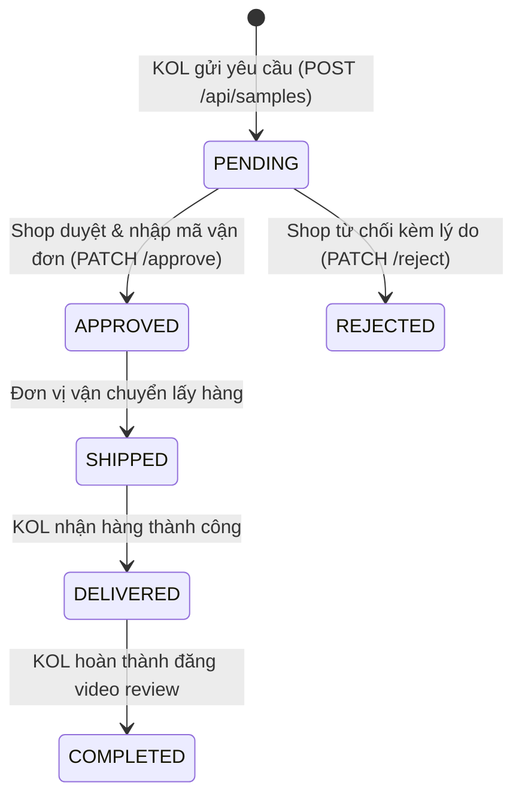

# FR-25 — Yêu Cầu và Quản Lý Mẫu Thử Sản Phẩm (Sample Product Requests)

## 1. Mục tiêu và Tổng quan Nghiệp vụ
Chức năng **FR-25: Yêu Cầu & Quản Lý Mẫu Thử Sản Phẩm** cung cấp quy trình khép kín giúp Creator/KOL trải nghiệm thực tế sản phẩm trước khi sản xuất video review hoặc livestream bán hàng.

- **KOL/Collaborator**: Duyệt danh sách sản phẩm mẫu của Shop, gửi yêu cầu xin mẫu kèm địa chỉ nhận hàng và ghi chú kế hoạch truyền thông.
- **Shop Manager**: Tiếp nhận danh sách yêu cầu, kiểm duyệt điều kiện (Tier KOL, lịch sử chuyển đổi), chấp thuận kèm mã vận đơn giao hàng (`trackingNumber`, `shippingCarrier`) hoặc từ chối kèm lý do rõ ràng.
- **Hệ thống**: Tự động thông báo qua Notification, ghi Audit Log và cập nhật trạng thái kho mẫu thử.

---

## 2. Luồng Nghiệp Vụ và Trạng Thái Vòng Đời

---

## 3. Danh sách Endpoint API

| Method | Endpoint | Quyền | Mô tả |
|---|---|---|---|
| `POST` | `/api/samples` | `COLLABORATOR` | KOL tạo yêu cầu xin mẫu thử sản phẩm |
| `GET` | `/api/samples/my-requests` | `COLLABORATOR` | KOL lấy danh sách các yêu cầu của bản thân |
| `GET` | `/api/samples/shop-requests` | `SHOP_MANAGER` | Shop lấy danh sách yêu cầu cần duyệt |
| `PATCH` | `/api/samples/:id/approve` | `SHOP_MANAGER` | Shop duyệt cấp mẫu và cập nhật mã vận đơn |
| `PATCH` | `/api/samples/:id/reject` | `SHOP_MANAGER` | Shop từ chối yêu cầu kèm lý do |
| `GET` | `/api/samples/:id` | `AUTHENTICATED` | Xem chi tiết yêu cầu mẫu thử |

---

## 4. Đặc tả Giao diện & Trải nghiệm Người dùng (UI/UX)
- **KOL Workspace (`/app/samples`)**:
  - Thẻ sản phẩm mẫu với hình ảnh sắc nét, giá bán lẻ, hoa hồng dự kiến, nút "Xin mẫu thử miễn phí".
  - Modal điền thông tin giao hàng: Họ tên, số điện thoại, địa chỉ chi tiết (Tỉnh/Thành, Quận/Huyện), ghi chú cam kết ngày lên video.
  - Tab "Lịch sử yêu cầu": Theo dõi trạng thái thẻ badge màu (`Chờ duyệt` vàng hổ phách, `Đã duyệt` xanh ngọc lục bảo, `Đã từ chối` đỏ ruby), mã tracking bưu tá có nút sao chép nhanh.
- **Shop Management Portal (`/shop/samples`)**:
  - Bảng dữ liệu mật độ cao: Avatar KOL, tên kênh, số người theo dõi, sản phẩm yêu cầu, ngày gửi.
  - Bộ nút thao tác nhanh 1-click: "Duyệt đơn" (mở dialog nhập nhà vận chuyển + mã vận đơn), "Từ chối" (mở dialog nhập lý do từ chối).

---

## 5. Kiểm thử và Xác minh
- 100% kiểm thử tích hợp trên PostgreSQL thực tế.
- Chặn gửi yêu cầu trùng lặp khi sản phẩm đang có yêu cầu ở trạng thái `PENDING`.
- Xác thực địa chỉ giao hàng hợp lệ và số điện thoại chuẩn Việt Nam (10 chữ số).
