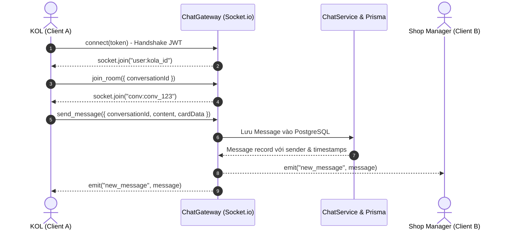

# FR-26 — Hệ Thống Trò Chuyện Trực Tuyến Thời Gian Thực (Real-Time Chat System)

## 1. Mục tiêu và Tổng quan Nghiệp vụ
Chức năng **FR-26: Trò Chuyện Trực Tuyến KOL & Shop** kết nối liên lạc trực tiếp, tức thì giữa nhà bán hàng và người sáng tạo nội dung mà không cần chuyển sang ứng dụng bên thứ ba.

- **KOL & Shop**: Trao đổi kịch bản video, thương lượng mức hoa hồng riêng biệt, giải đáp thắc mắc về công dụng sản phẩm và gửi ảnh thực tế.
- **Tính năng đính kèm thông minh**: Cho phép chia sẻ Thẻ sản phẩm (Product Card), Thẻ yêu cầu mẫu thử (Sample Request Card), và Thẻ lời mời chiến dịch độc quyền (Exclusive VIP Campaign Card).
- **Công nghệ cốt lõi**: NestJS WebSocket Gateway (Socket.io), REST fallback, PostgreSQL Message Store, JWT Authentication Handshake.

---

## 2. Kiến trúc Kết nối Socket.io & Phòng Hội Thoại

---

## 3. Danh sách Endpoint API & Socket Events

### REST API
| Method | Endpoint | Quyền | Mô tả |
|---|---|---|---|
| `GET` | `/api/chat/conversations` | `AUTHENTICATED` | Lấy danh sách hội thoại của người dùng |
| `POST` | `/api/chat/conversations` | `AUTHENTICATED` | Khởi tạo hoặc lấy hội thoại giữa 2 bên |
| `GET` | `/api/chat/conversations/:id/messages` | `AUTHENTICATED` | Lấy lịch sử tin nhắn kèm phân trang |
| `POST` | `/api/chat/conversations/:id/messages` | `AUTHENTICATED` | Gửi tin nhắn qua REST (Fallback khi mất WS) |
| `PATCH` | `/api/chat/conversations/:id/read` | `AUTHENTICATED` | Đánh dấu đã đọc toàn bộ tin nhắn |

### WebSocket Events
- `join_room`: Tham gia vào room hội thoại `conv:{conversationId}`.
- `leave_room`: Rời room hội thoại.
- `send_message`: Gửi tin nhắn mới.
- `new_message`: Nhận tin nhắn mới tức thì.
- `user_typing`: Trạng thái đang nhập văn bản.

---

## 4. Đặc tả Giao diện & Trải nghiệm Người dùng (UI/UX)
- **Giao diện 2 cột thông minh (Desktop) / Fullscreen (Mobile)**:
  - Cột trái: Danh sách người liên hệ, avatar, tên shop/KOL, badge số tin chưa đọc màu đỏ neon, trích đoạn tin nhắn mới nhất và thời gian tương đối (`vừa xong`, `5 phút trước`).
  - Cột phải: Khung chat chính với header hiển thị trạng thái online/offline (chấm xanh ngọc).
  - Bong bóng tin nhắn (Chat Bubbles): Tin nhắn của bản thân màu tím đậm/vàng kim (`bg-primary-600` hoặc `bg-amber-600`), tin nhắn đối phương màu xám nhạt (`bg-slate-100 dark:bg-slate-800`).
  - Đính kèm thẻ đa năng: Tự động phát hiện JSON type `PRODUCT_CARD`, `SAMPLE_CARD`, `CAMPAIGN_INVITE` và render thành Card tương tác cao cấp.

---

## 5. Kiểm thử và Xác minh
- Bộ test E2E xác thực Handshake JWT, phân quyền truy cập phòng chat, chống đọc trộm tin nhắn giữa các bên thứ ba (`403 Forbidden`).
