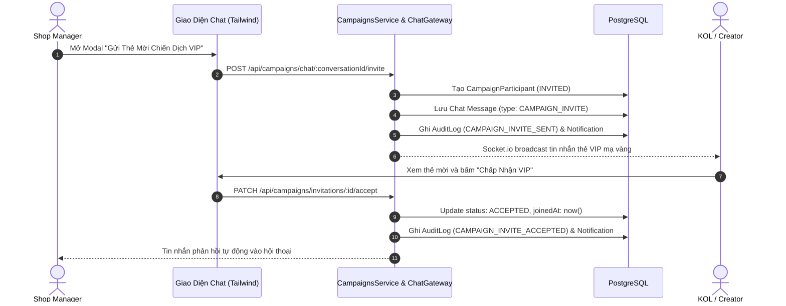

# FR-27 — Mời Chiến Dịch Độc Quyền Qua Khung Chat (Exclusive VIP Campaign Chat Invitations)

## 1. Mục tiêu và Tổng quan Nghiệp vụ
Chức năng **FR-27: Mời Chiến Dịch Độc Quyền Qua Chat** cho phép Shop Manager gửi trực tiếp "Thẻ Mời VIP" kèm mức hoa hồng thưởng thêm vượt khung (`bonusCommissionRate`) vào phòng chat riêng của Top KOL / Creator.

- **Shop Manager**: Tạo chiến dịch với mức thưởng hoa hồng đặc biệt (+5%, +7.5%, +10%), mở khung chat với KOL mục tiêu và gửi Thẻ mời VIP 1-click.
- **KOL / Creator**: Nhận thông báo tức thì, chiêm ngưỡng Thẻ Mời Mạ Vàng (Gold Shimmer Card) trong phòng chat và có quyền **Chấp nhận (Accept)** hoặc **Từ chối (Reject)** ngay trên thẻ.
- **Cơ chế minh bạch**: Ghi nhận `AuditLog`, cập nhật trạng thái `CampaignParticipant`, phát sinh thông báo hai chiều và tự động gửi tin nhắn phản hồi vào hội thoại.

---

## 2. Kiến trúc Xử Lý và Luồng Nghiệp Vụ

---

## 3. Danh sách Endpoint API

| Method | Endpoint | Quyền | Mô tả |
|---|---|---|---|
| `POST` | `/api/campaigns` | `SHOP_MANAGER` | Tạo chiến dịch độc quyền mới kèm hoa hồng thưởng |
| `GET` | `/api/campaigns/shop` | `SHOP_MANAGER` | Shop lấy danh sách các chiến dịch đã tạo |
| `POST` | `/api/campaigns/:id/invite` | `SHOP_MANAGER` | Shop gửi lời mời VIP cho KOL bằng collaboratorId |
| `POST` | `/api/campaigns/chat/:conversationId/invite` | `SHOP_MANAGER` | Shop gửi Thẻ Mời VIP trực tiếp từ cửa sổ Chat |
| `GET` | `/api/campaigns/my-invitations` | `COLLABORATOR` | KOL lấy danh sách các lời mời VIP nhận được |
| `PATCH` | `/api/campaigns/invitations/:id/accept` | `COLLABORATOR` | KOL chấp nhận tham gia chiến dịch VIP |
| `PATCH` | `/api/campaigns/invitations/:id/reject` | `COLLABORATOR` | KOL từ chối lời mời chiến dịch VIP |
| `GET` | `/api/campaigns/:id` | `AUTHENTICATED` | Xem chi tiết chiến dịch và danh sách KOL tham gia |

---

## 4. Đặc tả Giao diện & Trải nghiệm Người dùng (UI/UX)
- **Thẻ Mời VIP Mạ Vàng (Gold Shimmer Card)**:
  - Viền Gradient ánh kim hổ phách (`border-amber-400 bg-gradient-to-br from-amber-500/10 via-yellow-500/5 to-amber-600/15`).
  - Huy hiệu VIP hình vương miện (`👑 LỜI MỜI CHIẾN DỊCH ĐỘC QUYỀN`).
  - Badge hoa hồng thưởng thêm nổi bật (`+7.5% Thưởng thêm`).
  - Thông tin thời hạn hiệu lực, tên gian hàng và lời nhắn riêng từ chủ shop.
  - Nhóm nút hành động nhanh:
    - Nút "Chấp nhận" (Vàng kim đậm, icon tích xanh).
    - Nút "Từ chối" (Xám mờ tinh tế, icon dấu X).
    - Trạng thái đã xử lý: Tự động khóa nút bấm và hiển thị Badge trạng thái `Đã tham gia VIP` hoặc `Đã từ chối`.
- **Trang Quản Lý Chiến Dịch KOL (`/app/campaigns`)**:
  - Bộ lọc danh mục tab: `Tất cả`, `Lời mời chờ duyệt (Pending)`, `Đã tham gia (Accepted)`, `Đã từ chối (Rejected)`.
  - Nút chuyển nhanh sang phòng chat trực tiếp với gian hàng để trao đổi chi tiết.

---

## 5. Kiểm thử và Xác minh (16/16 Test Suites Passed)
- Suite E2E toàn diện [fr27-campaign-chat-invite.e2e-spec.ts](file:///d:/SEP490/SCANMS-project-capstone-fall26/backend/test/fr27-campaign-chat-invite.e2e-spec.ts):
  - Kiểm tra tính toán hoa hồng thưởng, chống mời trùng lặp, chống chấp nhận chéo giữa các KOL, phân quyền Shop và kiểm chứng Audit Log.
