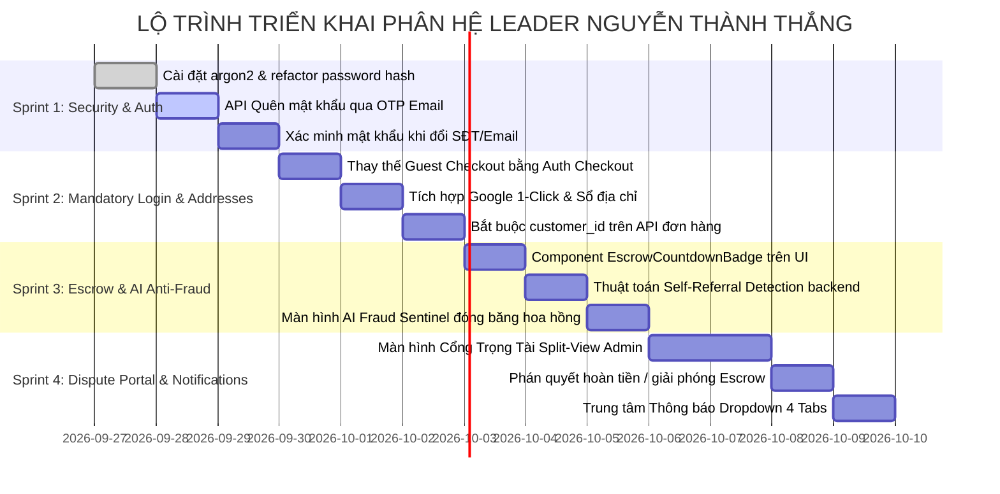

# 🛡️ KẾ HOẠCH THỰC THI & ĐẶC TẢ KỸ THUẬT PHÂN HỆ NGUYỄN THÀNH THẮNG (TEAM LEADER)
## HỆ THỐNG: SCANMS (FA26SE032) — Capstone Project Fall 2026
**Tài liệu tham chiếu:** [SCANMS_Ke_Hoach_Phan_Cong_Cong_Viec_Thanh_Vien_2026.docx](file:///c:/HW/CAPSTONE/docs/SCANMS_Ke_Hoach_Phan_Cong_Cong_Viec_Thanh_Vien_2026.docx)  
**Tác giả & Phụ trách:** Nguyễn Thành Thắng (MSSV: SE184251 — Team Leader & System Architect)  
**Phân hệ đảm nhiệm:** `SYSTEM_ADMIN` & Core Security / IAM / Escrow 14 Ngày / Cổng Trọng Tài / Chuông Báo / AI Fraud Sentinel  
**Ngày cập nhật:** 26/09/2026  

---

## 📌 MỤC LỤC
1. [Bối Cảnh & Rà Soát Hiện Trạng Codebase](#1-bối-cảnh--rà-soát-hiện-trạng-codebase)
2. [Đặc Tả Chi Tiết 6 Nhiệm Vụ Cốt Lõi Của Thắng](#2-đặc-tả-chi-tiết-6-nhiệm-vụ-cốt-lõi-của-thắng)
3. [Phân Tích Tác Động (Impact Analysis) & Ranh Giới An Toàn](#3-phân-tích-tác-động-impact-analysis--ranh-giới-an-toàn)
4. [Bộ Thư Viện & Công Nghệ Chuyên Nghiệp Đề Xuất](#4-bộ-thư-viện--công-nghệ-chuyên-nghiệp-đề-xuất)
5. [Lộ Trình Triển Khai 4 Sprint (Actionable Roadmap)](#5-lộ-trình-triển-khai-4-sprint-actionable-roadmap)
6. [Kịch Bản Thuyết Trình Bảo Vệ Trước Hội Đồng Capstone](#6-kịch-bản-thuyết-trình-bảo-vệ-trước-hội-đồng-capstone)
7. [Bảng Màu Chuẩn Vàng Be & Nguyên Tắc Bất Biến](#7-bảng-màu-chuẩn-vàng-be--nguyên-tắc-bất-biến)

---

## 1. BỐI CẢNH & RÀ SOÁT HIỆN TRẠNG CODEBASE

### 1.1. Ma trận phân bổ vai trò 4 thành viên (Bản thống nhất 2026)
Sau cuộc họp nội bộ và đối chiếu với mô hình thực tế của Shopee & TikTok Shop, nhóm đồ án chính thức phân chia trách nhiệm độc lập theo 4 miền vai trò:

| STT | Thành Viên | Vai Trò Chuyên Trách | Phân Hệ Nghiệp Vụ Cốt Lõi |
| :---: | :--- | :--- | :--- |
| **1** | **Nguyễn Phú Quý** | `MERCHANT` (Chủ Gian Hàng) | Quản lý kho hàng tồn kho $\le 5$, Shop chủ động hủy đơn & hoàn tiền, Shipping Simulator in phiếu A6 có Barcode, Thẩm định đổi trả 14 ngày, Voucher riêng của Shop. |
| **2** | **Nguyễn Đình Tuấn** | `KOL/KOC` & `SYSTEM_MANAGER` | Hoa hồng 2 tầng (Open Offer vs Exclusive Deal), Quy trình xin mẫu thử 4 bước, Voucher livestream đếm ngược, Hàng đợi duyệt Shop mới (KYC), Duyệt sản phẩm mới (Draft $\rightarrow$ Approved). |
| **3** | **Phan Xuân Thịnh** | `CUSTOMER` (Khách Mua Hàng) | Cổng Khách Hàng, Giỏ hàng đồng bộ Database PostgreSQL, Quy trình gửi yêu cầu đổi trả 14 ngày (bắt buộc video mở hộp), Đánh giá thật Verified Review Gate, In-App Chat Khách ⇄ Shop. |
| **4** | **NGUYỄN THÀNH THẮNG** | `SYSTEM_ADMIN` & Core Security / IAM | **Khóa bắt buộc 100% Đăng nhập (Xóa Guest Checkout, Google 1-Click), Quên mật khẩu OTP Email & Argon2id, Quỹ Escrow 14 ngày & Sổ cái 0đ phí, Cổng Trọng tài phân xử tranh chấp, Chuông báo đa vai trò, AI Fraud Sentinel chống tự mua.** |

### 1.2. Hiện trạng Kỹ thuật & Khoảng cách (Gap Analysis)
- **Cơ sở dữ liệu (Prisma Schema):** Đã có sẵn 41 bảng chuẩn 3NF. Đã có các bảng quan trọng: `User`, `CustomerAddress`, `Order`, `OrderRefund`, `Commission`, `Wallet`, `FinancialLedger`, `Notification`, `AuditLog`. Đặc biệt cột `OrderRefund.status` là `String @db.VarChar(50)` cho phép quản lý trạng thái tranh chấp linh hoạt mà **không cần chạy Migration sửa Enum**.
- **Auth & IAM:** [`auth.service.ts`](file:///c:/HW/CAPSTONE/backend/src/modules/auth/auth.service.ts) đã có OTP Đăng ký, Đăng nhập thường & Google OAuth. Vẫn đang dùng `bcryptjs`, chưa có API Quên mật khẩu gửi OTP (`POST /auth/forgot-password`), chưa có xác minh mật khẩu/OTP khi đổi thông tin nhạy cảm (SĐT/Email).
- **Khách vãng lai (Guest Checkout):** Vẫn còn file [`GuestCheckoutModal.tsx`](file:///c:/HW/CAPSTONE/frontend/src/components/checkout/GuestCheckoutModal.tsx) tại Marketplace và ProductDetail. Backend [`orders.service.ts`](file:///c:/HW/CAPSTONE/backend/src/modules/orders/orders.service.ts) vẫn cho phép `customerId` là `null`. Cần khóa chặt để đảm bảo tính pháp lý giao dịch.
- **Quỹ Escrow 14 ngày:** Backend [`commissions.service.ts`](file:///c:/HW/CAPSTONE/backend/src/modules/commissions/commissions.service.ts) đã có `COMMISSION_HOLD_DAYS = 14`, Cron đối soát mỗi phút. Cần bổ sung đồng hồ đếm ngược trực quan trên giao diện Dashboard Shop & KOL.
- **Cổng Trọng tài Admin:** Đã có Use Case diagram, cần xây dựng màn hình Split-View cho Admin: Bên trái xem Video mở hộp của Khách, bên phải xem văn bản giải trình của Shop.
- **Trung tâm Thông báo:** Schema có bảng `Notification`, nhưng nút Chuông trên [`Topbar.tsx`](file:///c:/HW/CAPSTONE/frontend/src/components/layout/Topbar.tsx) mới chỉ hiển thị Toast giả lập. Cần kết nối API và xây Dropdown 4 Tabs.
- **AI Fraud Sentinel:** [`ai-fraud.service.ts`](file:///c:/HW/CAPSTONE/backend/src/modules/ai/ai-fraud.service.ts) mới quét traffic đột biến. Cần bổ sung module đối soát **Self-Referral** (phát hiện người mua trùng IP, Device Fingerprint, Thẻ ngân hàng với KOL tạo link để khóa hoa hồng).

---

## 2. ĐẶC TẢ CHI TIẾT 6 NHIỆM VỤ CỐT LÕI CỦA THẮNG

### 🔹 Nhiệm vụ 1: Khóa Bắt Buộc 100% Đăng Nhập Tài Khoản (Xóa Bỏ Hoàn Toàn Khách Vãng Lai)
- **Bối cảnh & Điểm đau:** Khách mua hàng nặc danh không có tài khoản dẫn đến việc mất mã đơn hàng, không thể tra cứu hành trình, không có quyền mở khiếu nại đổi trả 14 ngày và gây thất thoát dữ liệu đối soát hoa hồng cho KOL.
- **Trải nghiệm trên giao diện (UI/UX Journey):**
  - Xóa bỏ nút và tiêu đề "GUEST CHECKOUT • ĐẶT HÀNG NHANH KHÔNG CẦN TÀI KHOẢN".
  - Khi khách bấm *"Mua ngay"* hoặc *"Thanh toán giỏ hàng"*, nếu chưa đăng nhập, hệ thống hiển thị ngay hộp thoại xác thực bảo mật:
    1. Nút **"Đăng nhập nhanh Google 1-Click"** (1.5 giây, tự động lấy họ tên, email, avatar).
    2. Form đăng nhập bằng Email & Mật khẩu / Đăng ký tài khoản mới.
  - Khi đăng nhập thành công, hệ thống tự động nạp danh sách địa chỉ từ Sổ địa chỉ cá nhân (`customerAddresses`). Khách chỉ cần 1 click chọn địa chỉ giao hàng.
  - Nếu khách nhập địa chỉ mới, hệ thống tự động lưu vào Sổ địa chỉ để tái sử dụng.
- **Logic xử lý ngầm (System & Business Logic):**
  - Mọi đơn hàng nội bộ (`sourcePlatform === 'INTERNAL'`) trong bảng `orders` bắt buộc phải có khóa ngoại `customer_id` hợp lệ liên kết tới bảng `users`.
  - Phía API `POST /orders`: Kiểm tra `req.user.id` bắt buộc đối với đơn nội bộ.

### 🔹 Nhiệm vụ 2: Luồng Quên Mật Khẩu Qua Mã OTP Email & Bảo Mật Xác Minh Khi Đổi SĐT/Email
- **Bối cảnh & Điểm đau:** Người dùng quên mật khẩu cần kênh khôi phục an toàn, tự động; tài khoản cần được bảo vệ trước hành vi chiếm đoạt thông tin giao nhận.
- **Trải nghiệm trên giao diện (UI/UX Journey):**
  - Tại trang [`LoginPage.tsx`](file:///c:/HW/CAPSTONE/frontend/src/pages/auth/LoginPage.tsx), thêm liên kết *"Quên mật khẩu?"* mở Modal 3 bước:
    * Bước 1: Nhập Email đã đăng ký $\rightarrow$ Bấm "Gửi mã xác thực".
    * Bước 2: Nhập mã OTP 6 chữ số nhận từ Email (kèm đồng hồ đếm ngược 5 phút).
    * Bước 3: Nhập Mật khẩu mới & Xác nhận mật khẩu mới.
  - Tại trang Hồ sơ cá nhân (Customer Portal / Shop Settings / Creator Profile): Khi người dùng thay đổi Số điện thoại nhận hàng hoặc Email, hệ thống bắt buộc nhập lại Mật khẩu hiện tại hoặc mã OTP xác nhận gửi về Email cũ.
- **Logic xử lý ngầm (System & Business Logic):**
  - Mã OTP 6 số được sinh ngẫu nhiên an toàn, lưu trong bộ nhớ đệm (hoặc Redis) có thời hạn chính xác 300 giây (5 phút), tự động hủy ngay sau 1 lần sử dụng.
  - Áp dụng Rate Limiting: Giới hạn tối đa 3 lần gửi OTP trong vòng 10 phút trên mỗi Email/IP.
  - Mật khẩu mới được băm và mã hóa bằng thuật toán **Argon2id** (đạt giải Password Hashing Competition, tiêu chuẩn khuyến nghị của OWASP Authentication Cheat Sheet).

### 🔹 Nhiệm vụ 3: Cơ Chế Quỹ Bảo Chứng Escrow 14 Ngày & Tự Động Quyết Toán Ví CTV (0đ Phí Ngân Hàng)
- **Bối cảnh & Điểm đau:** Trái tim tài chính của toàn bộ sàn SCANMS. Nếu đơn giao xong mà sàn thả tiền ngay cho Shop và KOL, khi người mua khiếu nại hàng giả thì Shop và KOL đã rút tiền tẩu thoát. Tiền phải được giữ trong Quỹ bảo chứng (Escrow) đúng 14 ngày.
- **Trải nghiệm trên giao diện (UI/UX Journey):**
  - Trên Dashboard của Shop (Quý phụ trách): Doanh thu hiển thị phân tách: *"Doanh thu đang bảo chứng (Escrow Pending)"* và *"Doanh thu khả dụng"*.
  - Trên Dashboard của KOL (Tuấn phụ trách): Hoa hồng hiển thị phân tách: *"Hoa hồng tạm giữ 14 ngày"* và *"Số dư ví khả dụng"*.
  - Mỗi đơn hàng đều gắn Component `EscrowCountdownBadge`: Hiển thị đồng hồ đếm ngược minh bạch (ví dụ: `Bảo chứng Escrow: Còn 11 ngày 06 giờ`).
- **Nâng Cấp Đột Phá — Cơ Chế Quỹ Escrow Thích Ứng Ngày Lễ & Tết Việt Nam (Adaptive Holiday-Aware Escrow Engine):**
  > 💡 **Giải quyết triệt để phản biện của GVHD (ThS. Tôn Thất Hoàng Minh):**  
  > *Nếu áp dụng cứng 14 ngày tự nhiên (Calendar Days), khi rơi vào kỳ nghỉ Tết Nguyên Đán (7 - 14 ngày) hoặc Quốc lễ 30/4 - 1/5: Các đơn vị vận chuyển (GHN, GHTK, Viettel Post) ngưng lấy hàng, Shop đóng cửa về quê, khách không thể gửi hàng hoàn và Shop không thể thẩm định. Nếu cron job tự động nhả tiền Escrow sau 14 ngày lịch thì quyền lợi của khách và Shop bị xâm hại nghiêm trọng.*
  - **1. Phân định Ngày Lịch (Calendar Days) vs Ngày Làm Việc Thực Tế (Statutory Operating Days):**
    Công thức tính toán ngày giải phóng tiền Escrow:
    $$\text{availableAt} = \text{eligibleAt} + 14 \text{ ngày} + \Delta_{\text{Holidays}}$$
    Trong đó $\Delta_{\text{Holidays}}$ là tổng số ngày nghỉ lễ/Tết chính thức theo quy định Nhà nước rơi vào chu trình bảo chứng của đơn hàng.
  - **2. Bảng Cấu Hình Lịch Nghỉ Lễ Việt Nam (Vietnam Statutory Holiday Calendar):**
    Hệ thống tích hợp danh mục ngày nghỉ lễ chính thức: Tết Nguyên Đán (7 - 14 ngày), Tết Dương Lịch (1/1), Giỗ Tổ Hùng Vương (10/3 ÂL), 30/4 - 1/5 và Quốc khánh 2/9. Trong các ngày này, bộ đếm Escrow **TỰ ĐỘNG ĐÓNG BĂNG (PAUSED / FROZEN)**, không tính vào 14 ngày.
  - **3. Nút Kích Hoạt Kỳ Nghỉ Lễ Toàn Sàn Dành Cho System Admin (Global Holiday Window Switch):**
    Admin (Thắng) có giao diện quản trị cấu hình: `POST /admin/escrow/holidays` để ban hành quyết định nghỉ lễ toàn sàn (ví dụ: *"Nghỉ Tết Nguyên Đán: từ 26 Tháng Chạp đến Mùng 8 Tháng Giêng"*). Hệ thống tự động dịch chuyển ngày `availableAt` của toàn bộ các đơn hàng vắt ngang qua kỳ nghỉ.
  - **4. Chế Độ Nghỉ Lễ / Đi Vắng Của Shop (Shop Vacation Mode — Chuẩn Shopee):**
    Shop có thể kích hoạt *"Chế độ nghỉ Tết"* trên Dashboard của Quý. Khi kích hoạt, thời hạn tiếp nhận và thẩm định video đổi trả của khách tự động được nới rộng thêm số ngày Shop đăng ký nghỉ, tránh việc Shop bị tự động xử thua do quá hạn phản hồi.
  - **5. Đóng Băng Tức Thời Khi Có Khiếu Nại (Dispute Auto-Freeze):**
    Bất kỳ lúc nào Khách gửi yêu cầu đổi trả (dù đơn mới nhận được 2 ngày hay 13 ngày), đồng hồ Escrow lập tức chuyển sang trạng thái `FROZEN_DISPUTE`, dừng đếm ngược vô thời hạn cho đến khi có phán quyết từ Shop hoặc Trọng tài Admin.
  - **6. Trực Quan Hóa Trên Giao Diện (Holiday Pause Badge):**
    Khi rơi vào ngày lễ, `EscrowCountdownBadge` tự động chuyển sang màu vàng hổ phách trang trọng kèm biểu tượng:  
    `⏸️ Tạm dừng đếm ngược do Kỳ nghỉ Tết Nguyên Đán (Tự động gia hạn thêm 10 ngày sau Lễ)`.
- **Logic xử lý ngầm (System & Business Logic):**
  - Khi đơn hàng chuyển trạng thái `DELIVERED` hoặc `COMPLETED`, hệ thống kích hoạt mốc `availableAt = calculateAvailableDate(eligibleAt, 14, holidays)`.
  - Cron Job chạy định kỳ mỗi phút: Quét các bản ghi `commissions` có `availableAt <= NOW()`, trạng thái `PENDING` và **không rơi vào ngày nghỉ lễ / tranh chấp** $\rightarrow$ Tự động chuyển sang `APPROVED` và cộng số dư khả dụng ví KOL.
  - Hạch toán thông qua **Sổ cái kép (Double-entry Ledger)** trong bảng `financial_ledgers` với thao tác số dư nội bộ nên hoàn toàn **0đ phí ngân hàng**.
  - Nếu đơn hàng bị hoàn tiền (Refund), hệ thống tự động kích hoạt cơ chế thu hồi (Clawback), hủy hoa hồng và trừ tồn quỹ.

### 🔹 Nhiệm vụ 4: Cổng Phân Xử Trọng Tài Khiếu Nại Đổi Trả Độc Lập (Dispute Resolution Portal)
- **Bối cảnh & Điểm đau:** Khi Khách hàng gửi yêu cầu trả hàng kèm video mở hộp nhưng Shop từ chối (bảo do khách làm rơi vỡ), hai bên rơi vào bế tắc tranh chấp. Cần Cổng Trọng Tài độc lập để Ban Quản Trị ra phán quyết cuối cùng.
- **Trải nghiệm trên giao diện (UI/UX Journey):**
  - Màn hình `DisputeResolutionPage.tsx` dành riêng cho vai trò `SYSTEM_ADMIN` (Thắng phụ trách).
  - Giao diện **Split-View** trực quan đối chiếu 2 bên:
    * **Cột trái (Khách hàng):** Thông tin đơn hàng, lý do khiếu nại, ảnh chụp lỗi và Trình phát Video mở hộp (Unboxing Video Player) có thanh tua từng giây.
    * **Cột phải (Shop):** Ảnh chụp biên bản đóng gói trước khi gửi, văn bản giải trình lý do từ chối.
  - Cụm nút phán quyết tối cao của Admin:
    1. Nút **"Chấp thuận hoàn tiền cho Khách"**: Yêu cầu nhập lý do phán quyết.
    2. Nút **"Bác bỏ khiếu nại, thanh toán cho Shop"**: Yêu cầu nhập lý do bác bỏ.
- **Logic xử lý ngầm (System & Business Logic):**
  - Nếu Admin chấp thuận hoàn tiền: Hệ thống trích tiền từ Quỹ bảo chứng Escrow hoàn trả 100% vào số dư ví của Khách, tự động kích hoạt Clawback hủy hoa hồng KOL, cộng lại tồn kho nếu khách trả hàng về.
  - Nếu Admin bác bỏ khiếu nại: Đơn hàng tiếp tục chu trình Escrow để nhả tiền cho Shop và KOL khi hết 14 ngày.
  - Phán quyết của Trọng tài là quyết định cuối cùng, trạng thái cập nhật thành `RESOLVED` và tự động ghi vào nhật ký kiểm toán bất biến `audit_logs`.

### 🔹 Nhiệm vụ 5: Trung Tâm Thông Báo Đa Vai Trò Thời Gian Thực (Multi-Role Notification Center)
- **Bối cảnh & Điểm đau:** Một hệ sinh thái 4 vai trò (Khách, Shop, KOL, Admin) không thể bắt người dùng phải liên tục F5 trang web để biết có đơn mới hay có biến động số dư.
- **Trải nghiệm trên giao diện (UI/UX Journey):**
  - Biểu tượng Chuông thông báo trang nhã trên thanh Header [`Topbar.tsx`](file:///c:/HW/CAPSTONE/frontend/src/components/layout/Topbar.tsx) cho tất cả các vai trò.
  - Khi có thông báo mới: Chuông hiển thị Badge đỏ số lượng chưa đọc kèm âm thanh thông báo "ting" tinh tế.
  - Click vào Chuông mở Dropdown / Drawer phân loại thành 4 Tabs:
    1. **Tất cả (All)**
    2. **Đơn hàng (Orders):** Khách nhận tin đơn đang giao / đã giao; Shop nhận tin có đơn mới đặt.
    3. **Tài chính (Finance):** KOL nhận tin hoa hồng về ví; Shop nhận tin tiền hàng giải phóng khỏi Escrow.
    4. **Hệ thống & Cảnh báo (System):** Admin nhận cảnh báo gian lận, hồ sơ tranh chấp mới; Shop nhận cảnh báo tồn kho $\le 5$.
  - Bấm vào từng thông báo sẽ tự động **Deep-link** dẫn người dùng đến thẳng trang chi tiết của sự kiện đó (ví dụ bấm vào tranh chấp $\rightarrow$ nhảy đến Cổng Trọng Tài).
- **Logic xử lý ngầm (System & Business Logic):**
  - Backend xây dựng `NotificationModule` lưu thông báo vào bảng `notifications`.
  - Có các hàm helper phát sự kiện: `notifyOrderCreated()`, `notifyCommissionApproved()`, `notifyDisputeOpened()`, `notifyFraudDetected()`.
  - Hỗ trợ đánh dấu đã đọc (`PATCH /notifications/:id/read`) và đánh dấu đọc tất cả (`PATCH /notifications/read-all`).

### 🔹 Nhiệm vụ 6: Thuật Toán AI Fraud Sentinel Chống Gian Lận Tự Mua (Self-Referral Fraud)
- **Bối cảnh & Điểm đau:** Trong tiếp thị liên kết, gian lận nhức nhối nhất là KOL tự tạo link tiếp thị rồi lập tài khoản phụ tự mua hàng để chiếm đoạt tiền hoa hồng của Shop, hoặc dùng script spam click ảo.
- **Trải nghiệm trên giao diện (UI/UX Journey):**
  - Màn hình AI Fraud Sentinel trên bảng điều khiển Admin ([`AiFraudSentinelPage.tsx`](file:///c:/HW/CAPSTONE/frontend/src/pages/merchant/AiFraudSentinelPage.tsx)) hiển thị:
    * Thẻ chỉ số tổng quan: Tổng số ca nghi vấn, Tỷ lệ rủi ro trung bình, Số tiền hoa hồng đang đóng băng bảo vệ Shop.
    * Bảng danh sách các giao dịch bị gắn cờ với thanh điểm **Risk Score ($0 \rightarrow 100$)**.
    * Chi tiết ca vi phạm: Đối chiếu địa chỉ IP, Thiết bị, Thẻ thanh toán giữa Người mua và KOL.
    * Nút hành động nhanh của Admin: *"Xác nhận gian lận & Tước hoa hồng"* hoặc *"Bỏ qua nghi vấn (Bình thường)"*.
- **Logic xử lý ngầm (System & Business Logic):**
  - Thu thập dữ liệu đa chiều khi click link tiếp thị và khi đặt hàng:
    * Client Device Fingerprint (Canvas, WebGL, AudioContext hash).
    * IP Address (bóc tách qua X-Forwarded-For).
    * Thông tin thanh toán / Số tài khoản ngân hàng.
  - Thuật toán Heuristic Risk Scoring:
    $$\text{Risk Score} = 40 \times \mathbb{I}(\text{IP trùng}) + 40 \times \mathbb{I}(\text{Device Fingerprint trùng}) + 20 \times \mathbb{I}(\text{Tên/SĐT tương đồng})$$
  - Nếu $\text{Risk Score} \ge 75$: Hệ thống lập tức gắn cờ `SELF_REFERRAL_DETECTED`, tự động chuyển trạng thái hoa hồng sang `FROZEN`, phát thông báo khẩn cấp đến Cổng Quản trị Admin.

---

## 3. PHÂN TÍCH TÁC ĐỘNG (IMPACT ANALYSIS) & RANH GIỚI AN TOÀN

```
┌────────────────────────────────────────────────────────────────────────────────────────────────┐
│                                 MA TRẬN GIAO THOA & CÁC BIỆN PHÁP CHỐNG VỠ LUỒNG               │
├────────────────────┬─────────────────────────────┬─────────────────────────────────────────────┤
│ Tính Năng Của Thắng│ Chức Năng Bị Tác Động       │ Giải Pháp Senior Kiểm Soát Rủi Ro           │
├────────────────────┼─────────────────────────────┼─────────────────────────────────────────────┤
│ Khóa Bắt Buộc Login│ Giỏ hàng DB của Thịnh       │ Cung cấp popup Google 1-Click tại giỏ hàng. │
│                    │                             │ Đăng nhập xong tự động giữ nguyên giỏ hàng. │
├────────────────────┼─────────────────────────────┼─────────────────────────────────────────────┤
│ Khóa Bắt Buộc Login│ Webhook Shopee/TikTok       │ Giữ cột `customerId` là nullable trong DB.  │
│                    │                             │ Chỉ bắt buộc kiểm tra `customerId` ở đơn web│
├────────────────────┼─────────────────────────────┼─────────────────────────────────────────────┤
│ Quỹ Escrow 14 ngày │ Dashboard Shop của Quý      │ Xuất 2 số liệu rành mạch: Doanh thu bảo     │
│                    │                             │ chứng (Pending) vs Doanh thu khả dụng.      │
├────────────────────┼─────────────────────────────┼─────────────────────────────────────────────┤
│ Quỹ Escrow 14 ngày │ Ví tiền KOL của Tuấn        │ Hiển thị đồng hồ đếm ngược 14 ngày rõ ràng. │
│                    │                             │ Tránh việc KOL thắc mắc tại sao chưa rút đc.│
├────────────────────┼─────────────────────────────┼─────────────────────────────────────────────┤
│ Cổng Trọng Tài     │ Shop thẩm định đổi trả (Quý)│ Khi Shop bấm 'Từ chối đổi trả', đơn tự động │
│                    │ Yêu cầu đổi trả của Thịnh   │ chuyển sang `DISPUTED` và khóa quyền Shop.  │
│                    │                             │ Quyền xử lý chuyển hoàn toàn cho Thắng.     │
├────────────────────┼─────────────────────────────┼─────────────────────────────────────────────┤
│ AI Fraud Sentinel  │ Trạng thái hoa hồng của Tuấn│ Khi hoa hồng bị đóng băng, ví KOL hiện nhãn │
│                    │                             │ 'Đang kiểm tra rủi ro', không gây crash app.│
└────────────────────┴─────────────────────────────┴─────────────────────────────────────────────┘
```

---

## 4. BỘ THƯ VIỆN & CÔNG NGHỆ CHUYÊN NGHIỆP ĐỀ XUẤT

| Phân Hệ | Thư Viện Đề Xuất | Mục Đích Kỹ Thuật & Giá Trị Thực Tế |
| :--- | :--- | :--- |
| **Bảo mật & Mật mã** | `argon2` | Thay thế hoàn toàn `bcryptjs`. Thuật toán băm bộ nhớ cao (Memory-hard) đạt chuẩn khuyến nghị OWASP Password Storage, chống brute-force bằng GPU/ASIC. |
| **Bảo vệ Endpoint** | `@nestjs/throttler` | Chống spam gửi mã OTP vào Email người dùng. Giới hạn tối đa 3 requests / 10 phút. |
| **Xác thực Google** | `google-auth-library` | Xác thực `idToken` từ Google Identity Services bằng public key chính thức của Google, đảm bảo không thể làm giả token. |
| **Định danh thiết bị** | `@fingerprintjs/fingerprintjs` | Thu thập Fingerprint trình duyệt (Canvas, WebGL, Audio) với độ chính xác > 99.5% để phát hiện KOL tự mua link bằng tab ẩn danh. |
| **Trình phát Video** | `react-player` / HTML5 Video | Cho phép Admin tua từng frame video mở hộp unboxing của khách hàng để thẩm định tem niêm phong. |
| **Tính toán tài chính** | Prisma `Decimal` | Sử dụng kiểu dữ liệu số chính xác cố định (Arbitrary-precision Decimal), triệt tiêu hoàn toàn lỗi sai số làm tròn số thực IEEE 754 trong Javascript. |
| **Âm thanh thông báo** | `use-sound` | Phát âm báo tinh tế ("ting") khi có đơn hàng mới hoặc có hoa hồng về ví, tạo trải nghiệm tương tác cao. |

---

## 5. LỘ TRÌNH TRIỂN KHAI 4 SPRINT (ACTIONABLE ROADMAP)



### Chi tiết các hạng mục kiểm tra hoàn thành (Checklist nghiệm thu):
- [ ] **Auth Core:** Test thành công gửi OTP quên mật khẩu về hòm thư thật. Nhập sai OTP báo lỗi, đúng OTP mới đổi được mật khẩu.
- [ ] **Argon2id:** Kiểm tra chuỗi hash trong database bắt đầu bằng `$argon2id$v=19$m=...`.
- [ ] **No Guest Checkout:** Bấm "Mua ngay" tại trang sản phẩm khi chưa đăng nhập $\rightarrow$ Xuất hiện popup yêu cầu Google Login hoặc Email Login. Sau khi login, giỏ hàng vẫn nguyên vẹn.
- [ ] **Address Book:** Đặt đơn mới với địa chỉ mới $\rightarrow$ Địa chỉ tự động thêm vào `customer_addresses`.
- [ ] **Escrow Timer:** Đơn hàng trạng thái `COMPLETED` hiển thị đồng hồ đếm ngược `Bảo chứng còn X ngày Y giờ`.
- [ ] **Dispute Portal:** Màn hình `/admin/disputes` chia đôi trực quan, phát được video mở hộp của khách, bấm nút phán quyết tự động hoàn tiền và ghi nhật ký Audit Log.
- [ ] **Notification Center:** Click icon Chuông trên Header mở Dropdown phân loại 4 tab rõ ràng, có nút "Đánh dấu tất cả đã đọc".
- [ ] **AI Fraud:** Tạo 1 đơn hàng với tài khoản có cùng IP/Fingerprint với KOL tạo link $\rightarrow$ Điểm Risk Score $\ge 75$, hoa hồng bị chuyển sang trạng thái `FROZEN`.

---

## 6. KỊCH BẢN THUYẾT TRÌNH BẢO VỆ TRƯỚC HỘI ĐỒNG CAPSTONE

Khi đứng trước Hội đồng chấm thi, Thắng (Trưởng nhóm) sẽ đảm nhiệm phần trình bày mở đầu và các bài toán cốt lõi:

1. **Phần mở đầu (1 phút):**  
   *"Kính thưa Thầy Cô Hội đồng, em là Nguyễn Thành Thắng - Trưởng nhóm đồ án SCANMS. Hệ thống của nhóm em được thiết kế theo mô hình Sàn Tiếp Thị Liên Kết Đa Gian Hàng (Multi-Merchant & Affiliate Network). Để đảm bảo an toàn giao dịch tuyệt đối, em đã thiết kế kiến trúc bảo mật danh tính bắt buộc 100% người mua phải có tài khoản qua Google 1-Click 1.5 giây, áp dụng mã hóa mật khẩu thế hệ mới Argon2id và xác thực hai lớp qua OTP Email."*
2. **Demo Quỹ Escrow 14 ngày Thích ứng Ngày Lễ & AI Fraud Sentinel (1.5 phút):**  
   *"Tiếp theo, đây là 'trái tim tài chính' của sàn: Quỹ bảo chứng Escrow 14 ngày. Đặc biệt, để giải quyết bài toán đặc thù Việt Nam khi cả nước nghỉ Tết Nguyên Đán hoặc các kỳ nghỉ lễ dài ngày mà bưu tá không giao nhận và Shop đóng cửa, hệ thống của em không đếm cứng 14 ngày lịch mà phát triển động cơ **Adaptive Holiday-Aware Escrow Engine**. Cơ chế này tự động đóng băng bộ đếm và gia hạn tương ứng theo Lịch nghỉ lễ Nhà nước hoặc Chế độ Shop Vacation Mode, bảo vệ tuyệt đối quyền lợi đổi trả của khách. Toàn bộ tiền hàng và hoa hồng của KOL được hạch toán bằng Sổ cái kép Double-entry Ledger 0đ phí ngân hàng. Song song đó, thuật toán AI Fraud Sentinel liên tục quét vân tay thiết bị và IP để phát hiện KOL tự mua qua link của mình (Self-Referral Fraud) nhằm đóng băng hoa hồng trục lợi."*
3. **Demo Cổng Phân Xử Trọng Tài (1.5 phút):**  
   *"Cuối cùng, khi phát sinh mâu thuẫn đổi trả giữa Người mua và Chủ gian hàng, hệ thống kích hoạt Cổng Trọng Tài độc lập dành cho Ban Quản Trị sàn. Màn hình Split-View cho phép đối soát trực tiếp video mở hộp unboxing của người mua với chứng từ đóng gói của người bán. Quyết định phán quyết của Trọng tài được tự động lưu vĩnh viễn vào nhật ký kiểm toán Audit Log bất biến."*

---

## 7. BẢNG MÀU CHUẨN VÀNG BE & NGUYÊN TẮC BẤT BIẾN

Toàn bộ các màn hình do Thắng phát triển bắt buộc phải tuân thủ nghiêm ngặt bảng mã màu quy định trong [AGENTS.md](file:///c:/HW/CAPSTONE/AGENTS.md) và [GEMINI.md](file:///c:/HW/CAPSTONE/GEMINI.md):

| Token Name | Hex Code | Vị Trí Bắt Buộc Áp Dụng |
| :--- | :--- | :--- |
| **`--canvas`** | `#FAF8F5` | Nền toàn bộ trang web (Soft Warm Cream) |
| **`--surface-sand`** | `#F3EFE6` | Nền Sidebar, khay tab chọn vai trò, khay lọc (Warm Sand) |
| **`--surface-white`** | `#FFFFFF` | Nền thẻ Card chính, ô form nhập liệu, modal hộp thoại |
| **`--brand`** | `#C59B58` | Nút bấm chính ("Đăng nhập", "Phán quyết", "Xác nhận"), CTA chính |
| **`--brand-strong`** | `#B88E4F` | Điểm nhấn chữ, icon thương hiệu, trạng thái active |
| **`--brand-soft`** | `#FBF5EB` | Nền badge ưu đãi, nền pill trạng thái Escrow |
| **`--brand-border`** | `#EEDFC6` | Viền badge, viền hộp thông tin |
| **`--brand-dark`** | `#231D15` | Nút phụ sang trọng (Dark Accent), thanh header tối |
| **`--line` / `--border`** | `#EAE4D7` | Đường kẻ phân cách, viền ô nhập liệu (Input), viền Card |
| **`--ink`** | `#1A1612` | Màu chữ chính, tiêu đề H1-H6, số liệu tài chính |
| **`--muted`** | `#7D715E` | Màu chữ phụ, mô tả, chú thích, nhãn phụ |
| **`--danger`** | `#DC2626` | Trạng thái lỗi, đóng băng gian lận, từ chối |

> ⚠️ **ĐIỀU CẤM KỴ:** Tuyệt đối không dùng màu xanh lá (Emerald/Teal `#0F766E`, `#10B981`) làm màu nền, thanh header hay nút bấm thương hiệu! Màu xanh lá chỉ dùng duy nhất cho icon tick nhỏ xác minh (`CheckCircle`) hoặc chỉ số tăng trưởng dương nhỏ.
