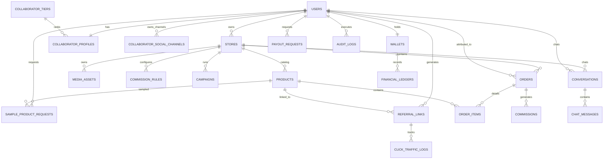
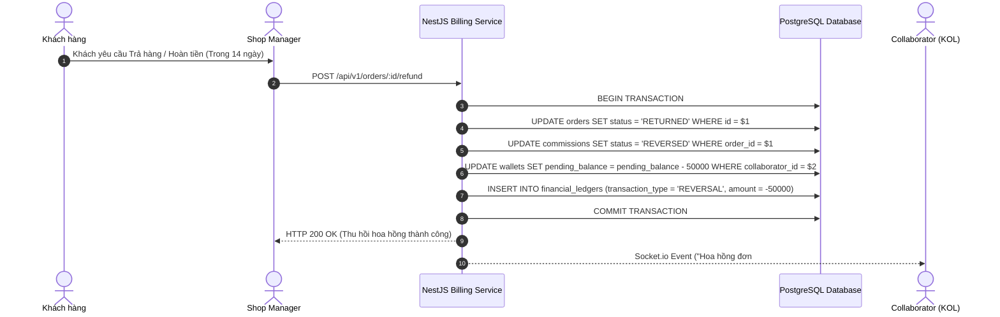

# SYSTEM ARCHITECTURE DESIGN (SAD)
## Project Name: InfluxNet - KOL & Sales Collaborator Management Platform
**Official Registered Code:** FA26SE032  
**Architecture Pattern:** Modular Monolith Architecture (NestJS + PostgreSQL + Redis + BullMQ + Socket.io)  
**Document Version:** 1.0.0 (Enterprise 21-Table Master Architecture)

---

## 1. HIGH-LEVEL SYSTEM ARCHITECTURE

Hệ thống **InfluxNet** được thiết kế theo kiến trúc **Modular Monolith** kết hợp **Event-Driven Async Processing** và **WebSocket Realtime Chat** nhằm đảm bảo khả năng mở rộng linh hoạt, phản hồi cực nhanh (< 200ms) và dễ bảo trì.

```mermaid
graph TD
    subgraph Client Layer
        A1[Executive Admin Portal - Next.js]
        A2[Manager & Staff Portal - Next.js]
        A3[Collaborator App - React / PWA]
        A4[Customer Browser / Mobile]
    end

    subgraph Gateway & Security Layer
        B1[Nginx Reverse Proxy / SSL]
        B2[NestJS API Gateway & Guards]
        B3[JWT Auth & RBAC 5-Role Middleware]
    end

    subgraph Core Business Modules (NestJS)
        C1[IAM, KYC, Tier & Social Channel Module]
        C2[Attribution & Tracking Engine]
        C3[Commission & Billing Engine]
        C4[Settlement & Wallet Engine]
        C5[Realtime Chat Module - Socket.io]
        C6[Analytics & AI Match Engine]
    end

    subgraph Data & Async Queue Layer
        D1[(PostgreSQL 15 - Primary 21-Table DB)]
        D2[(Redis Cache & Click Rate Limiter)]
        D3[BullMQ Async Task Queue]
    end

    A1 --> B1
    A2 --> B1
    A3 --> B1
    A4 --> B1
    B1 --> B2
    B2 --> B3
    B3 --> C1
    B3 --> C2
    B3 --> C3
    B3 --> C4
    B3 --> C5
    B3 --> C6
    C2 <--> D2
    C3 --> D3
    C4 <--> D1
    C5 <--> D2
    D3 --> D1
```

---

## 2. DATABASE ERD (21-TABLE MASTER ENTERPRISE DIAGRAM)



---

## 3. SEQUENCE DIAGRAMS (LUỒNG KỸ THUẬT PHỨC TẠP)

### 3.1 Sequence Diagram 1: Last-Click Attribution & Order Items Billing Flow
Mô tả chi tiết luồng khi Khách hàng nhấp vào Link giới thiệu của KOL/CTV, hệ thống kiểm tra Rate Limit qua Redis, thiết lập Signed Cookie và ghi nhận Đơn hàng chi tiết từng món (`order_items`).

```mermaid
sequenceDiagram
    autonumber
    actor Customer as Khách mua hàng
    participant Link as Referral Link / QR
    participant Gate as NestJS API Gateway
    participant Redis as Redis Cache (Click Buffer)
    participant DB as PostgreSQL DB
    participant Hook as E-commerce Webhook

    Customer->>Link: Nhấp vào Link / Scan QR (https://influxnet.vn/r/KOL_888)
    Link->>Gate: HTTP GET /r/KOL_888 (Header: IP, UserAgent)
    Gate->>Redis: Rate Limit Check (IP Rate Limit < 10 req/s)
    alt Pass Rate Limit
        Gate->>Redis: Log Click Traffic Async (Buffer Write)
        Gate-->>Customer: HTTP 302 Redirect sang trang sản phẩm<br>Set Cookie (influx_ref=KOL_888; Max-Age=30 ngày)
    else Exceeded Rate Limit (Spam)
        Gate-->>Customer: HTTP 302 Redirect sang sản phẩm (Không Set Cookie)
    end

    Note over Customer, Hook: Khách hàng tiến hành Mua hàng & Thanh toán
    Hook->>Gate: POST /api/v1/orders/webhook (Mã đơn, Chi tiết Items, Cookie/Coupon)
    Gate->>DB: Tìm kiếm Collaborator tương ứng với Cookie/Coupon
    Gate->>DB: Khởi tạo Header Order & Danh sách Order Items
    Gate->>DB: Tính hoa hồng từng sản phẩm -> Khởi tạo Commission (Status: PENDING)
    Gate-->>Hook: HTTP 200 OK (Order & Items Attributed Successfully)
```

---

### 3.2 Sequence Diagram 2: Refund Clawback & Commission Reversal Flow
Mô tả luồng xử lý khi Khách hàng Trả hàng / Hủy đơn trong 14 ngày, Shop Manager bấm đánh dấu `RETURNED`, hệ thống tự động thu hồi hoa hồng và ghi Sổ cái tài chính.



---

## 4. TECH STACK SPECIFICATION & DIRECTORY STRUCTURE

### 4.1 Technology Stack Selection
- **Backend:** NestJS (Node.js framework với TypeScript), `@nestjs/swagger`, `Socket.io`, `TypeORM`/`Prisma`.
- **Database:** PostgreSQL v15+ (Master 21-Table ACID Transactional Schema).
- **Cache & Queue:** Redis v7+ (Click Buffer & Rate Limiter), BullMQ (Async Background Tasks).
- **Frontend (Manager):** Next.js (App Router), TailwindCSS, ShadcnUI, Recharts.
- **Frontend (Collaborator):** ReactJS, Capacitor (Build Mobile App Android/iOS), TailwindCSS.

### 4.2 Repository Directory Blueprint
```
c:\HW\CAPSTONE\
├── backend/                  # Mã nguồn NestJS API
│   ├── src/
│   │   ├── modules/          # IAM, Tracking, Billing, Settlement, Chat, Analytics, AI
│   │   ├── common/           # Guards, Filters, Interceptors, Decorators
│   │   └── config/           # Database, Redis, Auth Configurations
├── frontend/                 # Mã nguồn Next.js & ReactJS App
│   ├── src/
│   │   ├── pages/
│   │   │   ├── admin/        # Executive Dashboard cho Super Admin
│   │   │   ├── manager/      # Trang Quản trị Cửa hàng, Duyệt Payout, Chat
│   │   │   ├── collaborator/ # Web App tối ưu Mobile cho CTV
│   │   │   └── mock-shop/    # Trang Shop Giả Lập để Demo Webhook!
│   │   └── components/       # AntD / Shadcn UI components
│   ├── package.json
│   └── vite.config.ts
├── docs/                     # Bộ tài liệu Engineering Documentation Suite (v1.0.0 Master)
│   ├── srs/                  # SRS_DOCUMENT.md & FEATURE_CATALOGUE_CLASSIFIED.md
│   ├── database/             # DATABASE_DESIGN.md & schema.sql
│   ├── architecture/         # SAD_DOCUMENT.md
│   └── api/                  # API_SPECIFICATION.md
└── docker-compose.yml        # Multi-container orchestration (Postgres, Redis, Backend)
```
