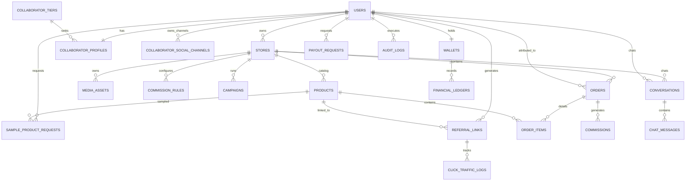

# DATABASE DESIGN SPECIFICATION (PRODUCTION-GRADE ARCHITECTURE)
## Project Name: InfluxNet - KOL & Sales Collaborator Management Platform
**Target DBMS:** PostgreSQL (v15+)  
**Document Version:** 1.0.0 (Unlimited Social Platform Architecture - 21 Tables)  
**Normalization Level:** 3rd Normal Form (3NF)  
**Design Standards:** 100% Soft Delete (`is_deleted`), Dynamic Multi-Platform Channels (`collaborator_social_channels`), Double-Entry Ledger, Financial Precision (`NUMERIC(15,2)`), Full Product Metadata, In-App Chat, Sample Product Workflows, Partial Indexing.

---

## 1. ENTITY RELATIONSHIP OVERVIEW (21 TABLES)

Cơ sở dữ liệu của **InfluxNet** gồm **21 bảng chuẩn 3NF**, hỗ trợ KOL đăng ký **KHÔNG GIỚI HẠN** các kênh Mạng xã hội (TikTok, Facebook, YouTube, Threads, Zalo, Telegram, Shopee Video, Lemon8, Website...):



---

## 2. DATA DICTIONARY (21 MASTER TABLES)

### 2.1 Table: `users`
Tài khoản người dùng hệ thống.

| Column Name | Data Type | Constraints | Description |
| :--- | :--- | :--- | :--- |
| `id` | UUID | PRIMARY KEY, DEFAULT `gen_random_uuid()` | ID duy nhất |
| `email` | VARCHAR(255) | UNIQUE, NOT NULL | Email đăng nhập |
| `password_hash` | VARCHAR(255) | NOT NULL | Mật khẩu băm bcrypt |
| `role` | VARCHAR(50) | NOT NULL, CHECK (`role` IN ('SYSTEM_ADMIN', 'SYSTEM_MANAGER', 'SHOP_MANAGER', 'SHOP_STAFF', 'COLLABORATOR')) | Vai trò |
| `full_name` | VARCHAR(150) | NOT NULL | Họ và tên |
| `phone_number` | VARCHAR(20) | NULL | Số điện thoại |
| `is_active` | BOOLEAN | NOT NULL, DEFAULT `true` | Trạng thái |
| `is_deleted` | BOOLEAN | NOT NULL, DEFAULT `false` | Cờ xóa mềm |
| `deleted_at` | TIMESTAMPTZ | NULL | Thời điểm xóa |
| `created_at`, `updated_at` | TIMESTAMPTZ | NOT NULL, DEFAULT `CURRENT_TIMESTAMP` | Timestamps |

---

### 2.2 Table: `stores`
Thông tin & Cấu hình Cửa hàng D2C.

| Column Name | Data Type | Constraints | Description |
| :--- | :--- | :--- | :--- |
| `id` | UUID | PRIMARY KEY, DEFAULT `gen_random_uuid()` | ID cửa hàng |
| `owner_id` | UUID | FK -> `users(id)`, NOT NULL | ID Shop Manager |
| `name` | VARCHAR(200) | NOT NULL | Tên cửa hàng |
| `slug` | VARCHAR(200) | UNIQUE, NOT NULL | Slug URL |
| `logo_url` | TEXT | NULL | Ảnh logo |
| `description` | TEXT | NULL | Mô tả |
| `website_url` | VARCHAR(255) | NULL | Link website/giỏ hàng |
| `default_commission_rate` | NUMERIC(5,2) | NOT NULL, DEFAULT `10.00` | % Hoa hồng mặc định |
| `attribution_window_days` | INTEGER | NOT NULL, DEFAULT `30` | Thời hạn Cookie (Ngày) |
| `min_payout_amount` | NUMERIC(15,2) | NOT NULL, DEFAULT `200000.00` | Hạn mức rút tối thiểu |
| `is_deleted` | BOOLEAN | NOT NULL, DEFAULT `false` | Cờ xóa mềm |
| `deleted_at` | TIMESTAMPTZ | NULL | Thời điểm xóa |
| `created_at`, `updated_at` | TIMESTAMPTZ | NOT NULL, DEFAULT `CURRENT_TIMESTAMP` | Timestamps |

---

### 2.3 Table: `collaborator_tiers`
Cấp bậc Cộng tác viên (Đồng, Bạc, Vàng, Kim Cương).

| Column Name | Data Type | Constraints | Description |
| :--- | :--- | :--- | :--- |
| `id` | UUID | PRIMARY KEY, DEFAULT `gen_random_uuid()` | ID cấp bậc |
| `name` | VARCHAR(50) | NOT NULL | Tên cấp bậc (`BRONZE`, `SILVER`, `GOLD`, `PLATINUM`) |
| `min_revenue_threshold` | NUMERIC(15,2) | NOT NULL, DEFAULT `0.00` | Doanh số tích lũy tối thiểu |
| `extra_bonus_percentage`| NUMERIC(5,2) | NOT NULL, DEFAULT `0.00` | % Hoa hồng thưởng thêm |
| `created_at` | TIMESTAMPTZ | NOT NULL, DEFAULT `CURRENT_TIMESTAMP` | Timestamps |

---

### 2.4 Table: `collaborator_profiles`
Hồ sơ KYC Ngân hàng, Thuế và Dữ liệu Tổng hợp của KOL.

| Column Name | Data Type | Constraints | Description |
| :--- | :--- | :--- | :--- |
| `id` | UUID | PRIMARY KEY, DEFAULT `gen_random_uuid()` | ID hồ sơ |
| `user_id` | UUID | FK -> `users(id)`, UNIQUE, NOT NULL | ID tài khoản CTV |
| `tier_id` | UUID | FK -> `collaborator_tiers(id)`, NULL | ID cấp bậc |
| `avatar_url` | TEXT | NULL | Ảnh đại diện |
| `bio` | TEXT | NULL | Tiểu sử / Giới thiệu |
| `id_card_number` | VARCHAR(50) | NULL | Số CMND/CCCD |
| `tax_code` | VARCHAR(50) | NULL | Mã số thuế cá nhân |
| `bank_name` | VARCHAR(100) | NOT NULL | Tên ngân hàng |
| `bank_account_number` | VARCHAR(50) | NOT NULL | Số tài khoản |
| `bank_account_name` | VARCHAR(150) | NOT NULL | Tên chủ tài khoản |
| `social_links_json` | JSONB | NULL | Dữ liệu JSON lưu nhanh tất cả link MXH |
| `total_followers` | INTEGER | NOT NULL, DEFAULT `0` | Tổng follower tất cả kênh |
| `total_earned_commission`| NUMERIC(15,2) | NOT NULL, DEFAULT `0.00` | Tổng hoa hồng tích lũy (Cache) |
| `total_orders_referred` | INTEGER | NOT NULL, DEFAULT `0` | Tổng số đơn giới thiệu (Cache) |
| `kyc_status` | VARCHAR(30) | NOT NULL, DEFAULT `'UNVERIFIED'` | UNVERIFIED, VERIFIED, REJECTED |
| `created_at`, `updated_at` | TIMESTAMPTZ | NOT NULL, DEFAULT `CURRENT_TIMESTAMP` | Timestamps |

---

### 2.5 Table: `collaborator_social_channels`
Bảng riêng lưu trữ danh sách không giới hạn các kênh Mạng xã hội của KOL (TikTok, Facebook, Youtube, Threads, Zalo, Telegram, Shopee Video, Lemon8...).

| Column Name | Data Type | Constraints | Description |
| :--- | :--- | :--- | :--- |
| `id` | UUID | PRIMARY KEY, DEFAULT `gen_random_uuid()` | ID kênh MXH |
| `collaborator_id` | UUID | FK -> `users(id)`, NOT NULL | ID tài khoản KOL |
| `platform_name` | VARCHAR(50) | NOT NULL | Tên nền tảng (`TIKTOK`, `FACEBOOK`, `YOUTUBE`, `INSTAGRAM`, `THREADS`, `ZALO`, `TELEGRAM`, `SHOPEE_VIDEO`, `LEMON8`, `OTHER`) |
| `channel_name` | VARCHAR(150) | NULL | Tên kênh / Username Handle |
| `channel_url` | TEXT | NOT NULL | Link dẫn tới kênh MXH |
| `follower_count` | INTEGER | NOT NULL, DEFAULT `0` | Số người theo dõi của kênh này |
| `is_primary` | BOOLEAN | NOT NULL, DEFAULT `false` | Có phải kênh chính hay không |
| `created_at` | TIMESTAMPTZ | NOT NULL, DEFAULT `CURRENT_TIMESTAMP` | Timestamps |

---

### 2.6 Table: `products`
Danh mục Sản phẩm Cửa hàng.

| Column Name | Data Type | Constraints | Description |
| :--- | :--- | :--- | :--- |
| `id` | UUID | PRIMARY KEY, DEFAULT `gen_random_uuid()` | ID sản phẩm |
| `store_id` | UUID | FK -> `stores(id)`, NOT NULL | ID cửa hàng |
| `sku` | VARCHAR(100) | NOT NULL | Mã SKU |
| `title` | VARCHAR(255) | NOT NULL | Tên sản phẩm |
| `category_name` | VARCHAR(100) | NULL | Phân loại ngành hàng |
| `description` | TEXT | NULL | Mô tả chi tiết |
| `image_url` | TEXT | NULL | Link ảnh đại diện |
| `original_price` | NUMERIC(15,2) | NULL | Giá gốc thị trường |
| `price` | NUMERIC(15,2) | NOT NULL, CHECK (`price` >= 0) | Giá bán thực tế |
| `custom_commission_rate`| NUMERIC(5,2) | NULL | Tỷ lệ hoa hồng riêng (%) |
| `stock_quantity` | INTEGER | NOT NULL, DEFAULT `0` | Số lượng tồn kho |
| `is_active` | BOOLEAN | NOT NULL, DEFAULT `true` | Trạng thái |
| `is_deleted` | BOOLEAN | NOT NULL, DEFAULT `false` | Cờ xóa mềm |
| `deleted_at` | TIMESTAMPTZ | NULL | Thời điểm xóa |
| `created_at`, `updated_at` | TIMESTAMPTZ | NOT NULL, DEFAULT `CURRENT_TIMESTAMP` | Timestamps |

---

### 2.7 Table: `media_assets`
Kho tài nguyên Marketing (Banner HD, Video, Bài viết mẫu SEO).

| Column Name | Data Type | Constraints | Description |
| :--- | :--- | :--- | :--- |
| `id` | UUID | PRIMARY KEY, DEFAULT `gen_random_uuid()` | ID tài nguyên |
| `store_id` | UUID | FK -> `stores(id)`, NOT NULL | ID cửa hàng |
| `product_id` | UUID | FK -> `products(id)`, NULL | ID sản phẩm |
| `title` | VARCHAR(255) | NOT NULL | Tiêu đề |
| `asset_type` | VARCHAR(50) | NOT NULL | IMAGE, VIDEO, COPYWRITE_TEXT |
| `url_or_content` | TEXT | NOT NULL | URL hoặc nội dung |
| `is_deleted` | BOOLEAN | NOT NULL, DEFAULT `false` | Cờ xóa mềm |
| `deleted_at` | TIMESTAMPTZ | NULL | Timestamps |
| `created_at` | TIMESTAMPTZ | NOT NULL, DEFAULT `CURRENT_TIMESTAMP` | Timestamps |

---

### 2.8 Table: `commission_rules`
Quy tắc hoa hồng thưởng doanh số tháng.

| Column Name | Data Type | Constraints | Description |
| :--- | :--- | :--- | :--- |
| `id` | UUID | PRIMARY KEY, DEFAULT `gen_random_uuid()` | ID quy tắc |
| `store_id` | UUID | FK -> `stores(id)`, NOT NULL | ID cửa hàng |
| `name` | VARCHAR(150) | NOT NULL | Tên quy tắc |
| `min_monthly_revenue` | NUMERIC(15,2) | NOT NULL, DEFAULT `0.00` | Doanh số mốc tối thiểu |
| `bonus_percentage` | NUMERIC(5,2) | NOT NULL, DEFAULT `0.00` | % Thưởng thêm |
| `is_deleted` | BOOLEAN | NOT NULL, DEFAULT `false` | Cờ xóa mềm |
| `deleted_at` | TIMESTAMPTZ | NULL | Timestamps |
| `created_at` | TIMESTAMPTZ | NOT NULL, DEFAULT `CURRENT_TIMESTAMP` | Timestamps |

---

### 2.9 Table: `sample_product_requests`
Yêu cầu xin sản phẩm mẫu dùng thử để KOL làm video review.

| Column Name | Data Type | Constraints | Description |
| :--- | :--- | :--- | :--- |
| `id` | UUID | PRIMARY KEY, DEFAULT `gen_random_uuid()` | ID yêu cầu |
| `collaborator_id` | UUID | FK -> `users(id)`, NOT NULL | ID KOL |
| `product_id` | UUID | FK -> `products(id)`, NOT NULL | ID sản phẩm |
| `shipping_address` | TEXT | NOT NULL | Địa chỉ nhận |
| `tracking_number` | VARCHAR(100) | NULL | Mã vận đơn |
| `status` | VARCHAR(30) | NOT NULL, DEFAULT `'PENDING'` | PENDING, APPROVED, REJECTED, SHIPPED |
| `created_at`, `updated_at` | TIMESTAMPTZ | NOT NULL, DEFAULT `CURRENT_TIMESTAMP` | Timestamps |

---

### 2.10 Table: `referral_links`
Link giới thiệu mã hóa & Mã QR Code động.

| Column Name | Data Type | Constraints | Description |
| :--- | :--- | :--- | :--- |
| `id` | UUID | PRIMARY KEY, DEFAULT `gen_random_uuid()` | ID link |
| `collaborator_id` | UUID | FK -> `users(id)`, NOT NULL | ID CTV |
| `product_id` | UUID | FK -> `products(id)`, NOT NULL | ID sản phẩm |
| `short_code` | VARCHAR(50) | UNIQUE, NOT NULL | Mã ngắn (`ref_a9k2`) |
| `custom_coupon_code` | VARCHAR(50) | UNIQUE, NULL | Mã coupon riêng |
| `qr_code_url` | TEXT | NULL | Link chứa ảnh QR Code |
| `total_clicks` | INTEGER | NOT NULL, DEFAULT `0` | Counter cache nhấp |
| `total_orders` | INTEGER | NOT NULL, DEFAULT `0` | Counter cache đơn |
| `is_deleted` | BOOLEAN | NOT NULL, DEFAULT `false` | Cờ xóa mềm |
| `deleted_at` | TIMESTAMPTZ | NULL | Timestamps |
| `created_at` | TIMESTAMPTZ | NOT NULL, DEFAULT `CURRENT_TIMESTAMP` | Timestamps |

---

### 2.11 Table: `click_traffic_logs`
Nhật ký traffic nhấp chuột thời gian thực.

| Column Name | Data Type | Constraints | Description |
| :--- | :--- | :--- | :--- |
| `id` | UUID | PRIMARY KEY, DEFAULT `gen_random_uuid()` | ID lượt click |
| `referral_link_id` | UUID | FK -> `referral_links(id)`, NOT NULL | ID link tiếp thị |
| `ip_address` | VARCHAR(45) | NOT NULL | Địa chỉ IP |
| `user_agent` | TEXT | NULL | Thông tin trình duyệt/thiết bị |
| `device_fingerprint` | VARCHAR(255) | NULL | Dấu vân tay thiết bị |
| `created_at` | TIMESTAMPTZ | NOT NULL, DEFAULT `CURRENT_TIMESTAMP` | Timestamps |

---

### 2.12 Table: `campaigns`
Chiến dịch tiếp thị đặc biệt của Shop dành cho Top KOLs.

| Column Name | Data Type | Constraints | Description |
| :--- | :--- | :--- | :--- |
| `id` | UUID | PRIMARY KEY, DEFAULT `gen_random_uuid()` | ID chiến dịch |
| `store_id` | UUID | FK -> `stores(id)`, NOT NULL | ID cửa hàng |
| `name` | VARCHAR(200) | NOT NULL | Tên chiến dịch |
| `bonus_commission_rate` | NUMERIC(5,2) | NOT NULL, DEFAULT `5.00` | % Thưởng riêng |
| `start_date`, `end_date` | TIMESTAMPTZ | NOT NULL | Thời gian chiến dịch |
| `is_active` | BOOLEAN | NOT NULL, DEFAULT `true` | Trạng thái |
| `created_at` | TIMESTAMPTZ | NOT NULL, DEFAULT `CURRENT_TIMESTAMP` | Timestamps |

---

### 2.13 Table: `orders`
Header Đơn hàng đồng bộ từ hệ thống E-commerce.

| Column Name | Data Type | Constraints | Description |
| :--- | :--- | :--- | :--- |
| `id` | UUID | PRIMARY KEY, DEFAULT `gen_random_uuid()` | ID đơn hàng |
| `store_id` | UUID | FK -> `stores(id)`, NOT NULL | ID cửa hàng |
| `external_order_sn` | VARCHAR(100) | NOT NULL | Mã đơn hàng |
| `attributed_collaborator_id`| UUID | FK -> `users(id)`, NULL | ID CTV |
| `attribution_method` | VARCHAR(50) | NULL | COOKIE, COUPON, FINGERPRINT |
| `customer_name` | VARCHAR(150) | NULL | Họ tên người mua |
| `customer_phone` | VARCHAR(20) | NULL | SĐT người mua |
| `shipping_address` | TEXT | NULL | Địa chỉ giao hàng |
| `subtotal_amount` | NUMERIC(15,2) | NOT NULL | Tổng tiền sản phẩm |
| `discount_amount` | NUMERIC(15,2) | NOT NULL, DEFAULT `0.00` | Số tiền giảm giá |
| `final_amount` | NUMERIC(15,2) | NOT NULL | Tổng tiền thanh toán |
| `status` | VARCHAR(50) | NOT NULL | PENDING, SHIPPING, DELIVERED, COMPLETED, CANCELLED, RETURNED |
| `created_at`, `updated_at` | TIMESTAMPTZ | NOT NULL, DEFAULT `CURRENT_TIMESTAMP` | Timestamps |

---

### 2.14 Table: `order_items`
Chi tiết từng sản phẩm trong Đơn hàng.

| Column Name | Data Type | Constraints | Description |
| :--- | :--- | :--- | :--- |
| `id` | UUID | PRIMARY KEY, DEFAULT `gen_random_uuid()` | ID chi tiết đơn |
| `order_id` | UUID | FK -> `orders(id)`, NOT NULL | ID đơn hàng cha |
| `product_id` | UUID | FK -> `products(id)`, NOT NULL | ID sản phẩm |
| `quantity` | INTEGER | NOT NULL, CHECK (`quantity` > 0) | Số lượng |
| `unit_price` | NUMERIC(15,2) | NOT NULL | Đơn giá mua |
| `applied_commission_rate`| NUMERIC(5,2) | NOT NULL | % Hoa hồng áp dụng |
| `calculated_commission_amount`| NUMERIC(15,2) | NOT NULL | Số tiền hoa hồng thực tính |
| `created_at` | TIMESTAMPTZ | NOT NULL, DEFAULT `CURRENT_TIMESTAMP` | Timestamps |

---

### 2.15 Table: `commissions`
Bản ghi tổng hợp hoa hồng đơn hàng của CTV.

| Column Name | Data Type | Constraints | Description |
| :--- | :--- | :--- | :--- |
| `id` | UUID | PRIMARY KEY, DEFAULT `gen_random_uuid()` | ID hoa hồng |
| `order_id` | UUID | FK -> `orders(id)`, NOT NULL | ID đơn hàng |
| `collaborator_id` | UUID | FK -> `users(id)`, NOT NULL | ID CTV |
| `commission_amount` | NUMERIC(15,2) | NOT NULL | Tổng tiền hoa hồng |
| `status` | VARCHAR(30) | NOT NULL, DEFAULT `'PENDING'` | PENDING, APPROVED, REVERSED |
| `approved_at` | TIMESTAMPTZ | NULL | Thời điểm duyệt cộng ví |
| `created_at` | TIMESTAMPTZ | NOT NULL, DEFAULT `CURRENT_TIMESTAMP` | Timestamps |

---

### 2.16 Table: `wallets`
Ví tiền CTV (Bảo vệ Pessimistic Locking & Optimistic Versioning).

| Column Name | Data Type | Constraints | Description |
| :--- | :--- | :--- | :--- |
| `id` | UUID | PRIMARY KEY, DEFAULT `gen_random_uuid()` | ID ví tiền |
| `collaborator_id` | UUID | FK -> `users(id)`, UNIQUE, NOT NULL | ID CTV sở hữu ví |
| `available_balance` | NUMERIC(15,2) | NOT NULL, DEFAULT `0.00`, CHECK (`available_balance` >= 0) | Số dư khả dụng |
| `pending_balance` | NUMERIC(15,2) | NOT NULL, DEFAULT `0.00`, CHECK (`pending_balance` >= 0) | Số dư chờ duyệt |
| `version` | INTEGER | NOT NULL, DEFAULT `1` | Khóa phiên bản |
| `updated_at` | TIMESTAMPTZ | NOT NULL, DEFAULT `CURRENT_TIMESTAMP` | Timestamps |

---

### 2.17 Table: `financial_ledgers`
Sổ cái tài chính bất biến (Append-Only Immutable Double-Entry Ledger).

| Column Name | Data Type | Constraints | Description |
| :--- | :--- | :--- | :--- |
| `id` | UUID | PRIMARY KEY, DEFAULT `gen_random_uuid()` | ID bản ghi sổ cái |
| `wallet_id` | UUID | FK -> `wallets(id)`, NOT NULL | ID ví tiền |
| `transaction_type` | VARCHAR(50) | NOT NULL | COMMISSION_APPROVED, PAYOUT_WITHDRAW, REVERSAL, PAYOUT_REJECT_REFUND |
| `amount` | NUMERIC(15,2) | NOT NULL | Số tiền biến động (+/-) |
| `balance_before` | NUMERIC(15,2) | NOT NULL | Số dư trước giao dịch |
| `balance_after` | NUMERIC(15,2) | NOT NULL | Số dư sau giao dịch |
| `reference_id` | UUID | NULL | ID tham chiếu |
| `created_at` | TIMESTAMPTZ | NOT NULL, DEFAULT `CURRENT_TIMESTAMP` | Timestamps |

---

### 2.18 Table: `payout_requests`
Yêu cầu rút tiền, Ảnh bill chuyển khoản và Lý do từ chối.

| Column Name | Data Type | Constraints | Description |
| :--- | :--- | :--- | :--- |
| `id` | UUID | PRIMARY KEY, DEFAULT `gen_random_uuid()` | ID yêu cầu |
| `collaborator_id` | UUID | FK -> `users(id)`, NOT NULL | ID CTV |
| `amount` | NUMERIC(15,2) | NOT NULL, CHECK (`amount` > 0) | Số tiền rút |
| `status` | VARCHAR(30) | NOT NULL, DEFAULT `'PENDING'` | PENDING, APPROVED, REJECTED |
| `bank_ref_code` | VARCHAR(100) | NULL | Mã giao dịch ngân hàng |
| `proof_image_url` | TEXT | NULL | Ảnh bill chuyển khoản |
| `rejected_reason` | TEXT | NULL | Lý do từ chối |
| `processed_at` | TIMESTAMPTZ | NULL | Thời điểm duyệt |
| `created_at` | TIMESTAMPTZ | NOT NULL, DEFAULT `CURRENT_TIMESTAMP` | Timestamps |

---

### 2.19 Table: `conversations`
Cuộc trò chuyện Chat 1-1 giữa Shop Manager và KOL.

| Column Name | Data Type | Constraints | Description |
| :--- | :--- | :--- | :--- |
| `id` | UUID | PRIMARY KEY, DEFAULT `gen_random_uuid()` | ID cuộc trò chuyện |
| `store_id` | UUID | FK -> `stores(id)`, NOT NULL | ID cửa hàng |
| `collaborator_id` | UUID | FK -> `users(id)`, NOT NULL | ID KOL |
| `last_message_at` | TIMESTAMPTZ | NOT NULL, DEFAULT `CURRENT_TIMESTAMP` | Thời điểm tin nhắn cuối |
| `created_at` | TIMESTAMPTZ | NOT NULL, DEFAULT `CURRENT_TIMESTAMP` | Timestamps |

---

### 2.20 Table: `chat_messages`
Chi tiết từng tin nhắn Chat Realtime.

| Column Name | Data Type | Constraints | Description |
| :--- | :--- | :--- | :--- |
| `id` | UUID | PRIMARY KEY, DEFAULT `gen_random_uuid()` | ID tin nhắn |
| `conversation_id` | UUID | FK -> `conversations(id)`, NOT NULL | ID hội thoại |
| `sender_id` | UUID | FK -> `users(id)`, NOT NULL | ID người gửi |
| `message_text` | TEXT | NOT NULL | Nội dung tin nhắn |
| `media_url` | TEXT | NULL | Link đính kèm |
| `is_read` | BOOLEAN | NOT NULL, DEFAULT `false` | Trạng thái đã đọc |
| `created_at` | TIMESTAMPTZ | NOT NULL, DEFAULT `CURRENT_TIMESTAMP` | Timestamps |

---

### 2.21 Table: `audit_logs`
Nhật ký vết thao tác bảo mật và Cảnh báo AI Fraud.

| Column Name | Data Type | Constraints | Description |
| :--- | :--- | :--- | :--- |
| `id` | UUID | PRIMARY KEY, DEFAULT `gen_random_uuid()` | ID nhật ký |
| `user_id` | UUID | FK -> `users(id)`, NULL | ID người thực hiện |
| `action` | VARCHAR(100) | NOT NULL | Hành động (VD: `PAYOUT_APPROVE`, `AI_FRAUD_FLAG`) |
| `details` | JSONB | NULL | Dữ liệu chi tiết dạng JSON |
| `ip_address` | VARCHAR(45) | NULL | Địa chỉ IP |
| `created_at` | TIMESTAMPTZ | NOT NULL, DEFAULT `CURRENT_TIMESTAMP` | Timestamps |

---

## ⚡ 3. STRATEGIC INDEXING & PRODUCTION OPTIMIZATIONS

### 3.1 Partial Unique Indexes (Soft Delete Safe)
Tránh xung đột trùng lắp dữ liệu khi thực hiện Soft Delete (`is_deleted = true`):

```sql
CREATE UNIQUE INDEX idx_users_active_email ON users(email) WHERE is_deleted = false;
CREATE UNIQUE INDEX idx_stores_active_slug ON stores(slug) WHERE is_deleted = false;
CREATE UNIQUE INDEX idx_ref_links_active_short_code ON referral_links(short_code) WHERE is_deleted = false;
CREATE UNIQUE INDEX idx_ref_links_active_coupon ON referral_links(custom_coupon_code) WHERE is_deleted = false AND custom_coupon_code IS NOT NULL;
```

### 3.2 Foreign Key B-Tree Indexing (Tránh Full Table Scans)
Tối ưu 100% các truy vấn `JOIN`, `DELETE CASCADE` trên toàn hệ thống theo Supabase Best Practices:

```sql
CREATE INDEX idx_fk_stores_owner ON stores(owner_id);
CREATE INDEX idx_fk_collab_profiles_tier ON collaborator_profiles(tier_id);
CREATE INDEX idx_fk_products_store ON products(store_id);
CREATE INDEX idx_fk_media_assets_store ON media_assets(store_id);
CREATE INDEX idx_fk_media_assets_product ON media_assets(product_id);
CREATE INDEX idx_fk_sample_req_collab ON sample_product_requests(collaborator_id);
CREATE INDEX idx_fk_sample_req_product ON sample_product_requests(product_id);
CREATE INDEX idx_fk_ref_links_collab ON referral_links(collaborator_id);
CREATE INDEX idx_fk_ref_links_product ON referral_links(product_id);
CREATE INDEX idx_fk_campaigns_store ON campaigns(store_id);
CREATE INDEX idx_fk_orders_store ON orders(store_id);
CREATE INDEX idx_fk_orders_collab ON orders(attributed_collaborator_id);
CREATE INDEX idx_fk_order_items_order ON order_items(order_id);
CREATE INDEX idx_fk_order_items_product ON order_items(product_id);
CREATE INDEX idx_fk_commissions_order ON commissions(order_id);
CREATE INDEX idx_fk_commissions_collab ON commissions(collaborator_id);
CREATE INDEX idx_fk_ledgers_wallet ON financial_ledgers(wallet_id);
CREATE INDEX idx_fk_payouts_collab ON payout_requests(collaborator_id);
CREATE INDEX idx_fk_conversations_store ON conversations(store_id);
CREATE INDEX idx_fk_conversations_collab ON conversations(collaborator_id);
CREATE INDEX idx_fk_chat_messages_conv ON chat_messages(conversation_id);
CREATE INDEX idx_fk_chat_messages_sender ON chat_messages(sender_id);
CREATE INDEX idx_fk_audit_logs_user ON audit_logs(user_id);
```

### 3.3 Strategic Query Indexes
Chỉ mục có điều kiện phục vụ các câu truy vấn tần suất cao:

```sql
CREATE INDEX idx_click_logs_link_date ON click_traffic_logs(referral_link_id, created_at DESC);
CREATE INDEX idx_orders_unattributed ON orders(created_at) WHERE attributed_collaborator_id IS NULL;
CREATE INDEX idx_payouts_pending ON payout_requests(collaborator_id, created_at) WHERE status = 'PENDING';
CREATE INDEX idx_ledgers_wallet_date ON financial_ledgers(wallet_id, created_at DESC);
CREATE INDEX idx_social_channels_collab ON collaborator_social_channels(collaborator_id);
```

---

## 🔒 4. SECURITY & AUTOMATION STANDARDS

### 4.1 Row-Level Security (RLS)
Tất cả 21 bảng được kích hoạt `ALTER TABLE ... ENABLE ROW LEVEL SECURITY;` để bảo vệ dữ liệu trên môi trường Supabase / PostgREST.

### 4.2 Automated `updated_at` Triggers
Hệ thống sử dụng hàm PL/pgSQL `update_updated_at_column()` và gán `BEFORE UPDATE` Trigger tự động cập nhật mốc thời gian sửa đổi cho tất cả các bảng.

