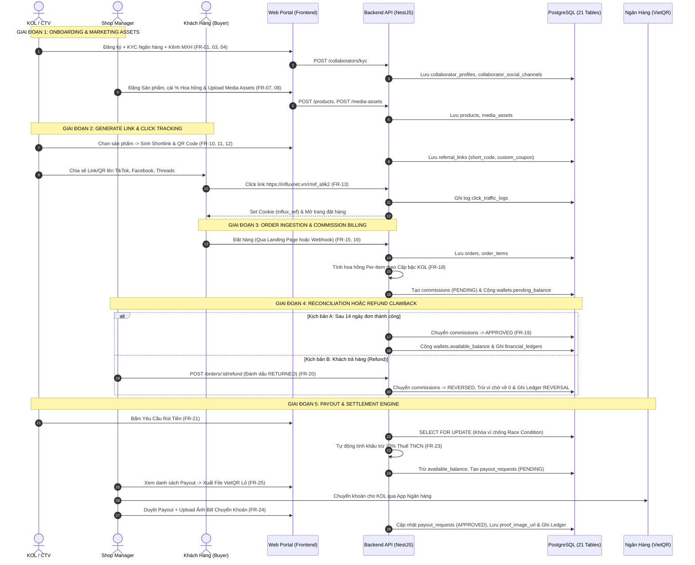

# TÀI LIỆU ĐẶC TẢ CHI TIẾT TẤT CẢ CHỨC NĂNG & PHÂN CHIA CÔNG VIỆC NHÓM
## DỰ ÁN: SCANMS / INFLUXNET (MÃ ĐỀ TÀI: FA26SE032)
### Tên Đồ án: Sales Collaborator and Affiliate Network Management System
> **Hệ thống Quản lý Đội ngũ Cộng tác viên Bán hàng và Tiếp thị Liên kết**  
> **Phiên bản tài liệu:** 1.0.0 (Master Enterprise Specification)  
> **Mục đích:** Tài liệu nguồn quy định toàn bộ tính năng, cơ chế vận hành, nghiệp vụ tài chính, luồng dữ liệu và phân chia công việc chi tiết cho 5 thành viên nhóm phát triển.

---

# MỤC LỤC
1. [TỔNG QUAN VÀ MA TRẬN 5 VAI TRÒ HỆ THỐNG](#1-tổng-quan-và-ma-trận-5-vai-trò-hệ-thống)
2. [CƠ CHẾ TIẾP NHẬN ĐƠN HÀNG TOÀN DIỆN CHO MỌI LOẠI SHOP](#2-cơ-chế-tiếp-nhận-đơn-hàng-toàn-diện-cho-mọi-loại-shop)
3. [CƠ CHẾ GHI NHẬN ĐƠN & TÍNH HOA HỒNG (ATTRIBUTION ENGINE)](#3-cơ-chế-ghi-nhận-đơn--tính-hoa-hồng-attribution-engine)
4. [CHI TIẾT TOÀN BỘ 32 CHỨC NĂNG HỆ THỐNG THEO 8 PHÂN HỆ](#4-chi-tiết-toàn-bộ-32-chức-năng-hệ-thống-theo-8-phân-hệ)
5. [SƠ ĐỒ LUỒNG DỮ LIỆU & QUAN HỆ GIỮA CÁC CHỨC NĂNG](#5-sơ-đồ-luồng-dữ-liệu--quan-hệ-giữa-các-chức-năng)
6. [MA TRẬN PHÂN CHIA CÔNG VIỆC CHI TIẾT CHO 5 THÀNH VIÊN (WBS)](#6-ma-trận-phân-chia-công-việc-chi-tiết-cho-5-thành-viên-wbs)
7. [DANH MỤC 19 MÀN HÌNH GIAO DIỆN (UI SCREENS) & NGƯỜI ĐẢM NHIỆM](#7-danh-mục-19-màn-hình-giao-diện-ui-screens--người-đảm-nhiệm)

---

# 1. TỔNG QUAN VÀ MA TRẬN 5 VAI TRÒ HỆ THỐNG

Hệ thống **SCANMS / InfluxNet** vận hành theo mô hình phân quyền chặt chẽ **Role-Based Access Control (RBAC)** với 5 vai trò:

```
                                SCANMS / INFLUXNET
        ┌───────────────────────────────┼───────────────────────────────┐
        ▼                               ▼                               ▼
 [SAAS / PLATFORM]              [MERCHANT / SHOP]              [INFLUENCER / CTV]
  ├── System Administrator       ├── Shop Manager (Chủ Shop)    └── Collaborator (KOL/KOC)
  └── System Manager (Web Admin) └── Shop Staff (Kế toán)
```

| STT | Vai trò (Role / Actor) | Đối tượng thực tế | Trách nhiệm và Quyền hạn chính |
| :---: | :--- | :--- | :--- |
| **1** | `SYSTEM_ADMIN` | Quản trị viên cấp cao nhất | Giám sát toàn bộ nền tảng SaaS, xem báo cáo doanh số tổng hợp, tra cứu Security Audit Logs cấp cao. |
| **2** | `SYSTEM_MANAGER` | Quản lý vận hành Web sàn | Phê duyệt và Onboard các Cửa hàng mới, quản lý danh sách ngân hàng toàn sàn (VietQR/Napas247), xử lý cảnh báo gian lận AI. |
| **3** | `SHOP_MANAGER` | Chủ thương hiệu / Merchant | Quản lý sản phẩm & tồn kho, cấu hình % hoa hồng và mốc thưởng, upload kho tài nguyên Media, duyệt yêu cầu gửi hàng mẫu, chat 1-1 với KOL, duyệt rút tiền kèm upload bill ngân hàng. |
| **4** | `SHOP_STAFF` | Nhân viên Shop / Kế toán | Hỗ trợ kiểm tra đơn hàng, đối soát hoàn trả (`RETURNED`), kiểm tra hồ sơ KYC và hỗ trợ chuẩn bị danh sách chuyển khoản lô. |
| **5** | `COLLABORATOR` | KOL / KOC / Affiliate Partner | Đăng ký KYC (CMND, Thuế, STK), liên kết không giới hạn kênh MXH (TikTok, Threads...), sinh Link/QR tiếp thị, xin hàng mẫu, chat trực tiếp với Shop, theo dõi Dashboard doanh số real-time và rút tiền hoa hồng. |
| **6** | `PUBLIC_BUYER` | Người mua hàng (Khách vãng lai / End-User) | Xem thông tin sản phẩm & Video review của KOL, nhập mã giảm giá, đặt hàng nhanh (Guest Checkout), tra cứu hành trình đơn hàng bằng SĐT/Mã đơn, gửi đánh giá review sản phẩm. |

---

# 2. CƠ CHẾ TIẾP NHẬN ĐƠN HÀNG TOÀN DIỆN CHO MỌI LOẠI SHOP

Để giải quyết bài toán thực tế cho cả Shop lớn lẫn Shop không có website hay sàn TMĐT, hệ thống hỗ trợ **4 phương thức tiếp nhận đơn hàng**:

```
                       4 PHƯƠNG THỨC TIẾP NHẬN ĐƠN HÀNG
 ┌───────────────────────────────────────┬──────────────────────────────────────────┐
 │ LOẠI HÌNH SHOP TRONG THỰC TẾ          │ GIẢI PHÁP TIẾP NHẬN CỦA SCANMS           │
 ├───────────────────────────────────────┼──────────────────────────────────────────┤
 │ 1. Shop KHÔNG CÓ Website, Không có Sàn│ 👉 Dùng Trang Đặt Hàng Trực Tiếp         │
 │    (Bán qua Zalo, Facebook, TikTok)   │    (Built-in Public Product Landing Page)│
 ├───────────────────────────────────────┼──────────────────────────────────────────┤
 │ 2. Shop Chốt đơn thủ công qua Chat    │ 👉 Tính năng Tạo Đơn Tay & Import Excel  │
 │    (Gọi điện, Inbox chốt đơn)         │    (Manual Order Entry & Batch CSV/Excel)│
 ├───────────────────────────────────────┼──────────────────────────────────────────┤
 │ 3. Shop tự code Website (PHP/Wordpress│ 👉 Chèn 1 dòng Javascript Tracking SDK   │
 │    (Không biết viết Webhook backend)  │    (Tương tự Facebook Pixel / GA4 Script)│
 ├───────────────────────────────────────┼──────────────────────────────────────────┤
 │ 4. Shop lớn có Sàn (Shopify/Shopee)   │ 👉 Bắn API Webhook Tự Động               │
 │    (Nền tảng E-Commerce chuyên nghiệp)│    (`POST /api/v1/orders/webhook`)       │
 └───────────────────────────────────────┴──────────────────────────────────────────┘
```

1. **Phương thức 1 - Dùng Trang Đặt Hàng Trực Tiếp có sẵn của SCANMS (Built-in Landing Page):**
   - Shop đăng sản phẩm lên SCANMS. KOL lấy link rút gọn (VD: `https://influxnet.vn/r/ref_a9k2`) chia sẻ cho khách.
   - Khách bấm vào link $\rightarrow$ Mở trang Landing Page của chính SCANMS $\rightarrow$ Nhập Tên, SĐT, Địa chỉ $\rightarrow$ Bấm **"Đặt mua ngay"**. Đơn hàng tự tạo, trừ tồn kho và sinh hoa hồng tức thì. *(Tối ưu nhất khi Demo bảo vệ Đồ án!)*
2. **Phương thức 2 - Tạo Đơn Thủ Công & Import File Excel (Manual Order & Batch CSV):**
   - Dành cho Shop chốt đơn qua điện thoại, inbox Fanpage. Shop Manager hoặc Kế toán vào màn hình *"Tạo đơn hàng"* nhập Tên khách và Mã giảm giá của KOL (hoặc upload file Excel 100 đơn cuối ngày) $\rightarrow$ Hệ thống tự phân bổ hoa hồng.
3. **Phương thức 3 - Đoạn mã nhúng Javascript Tracking SDK (1-Line Embed Code):**
   - Dành cho Shop có web riêng nhưng không rành backend. Shop chỉ cần chèn 1 thẻ `<script src="https://cdn.influxnet.vn/sdk.js" data-store-id="..."></script>` vào trang hoàn tất thanh toán.
4. **Phương thức 4 - Tích hợp API Webhook chuẩn Enterprise (`POST /orders/webhook`):**
   - Dành cho Shopify, WooCommerce, Haravan, Shopee Open Platform. Mỗi khi đơn thanh toán thành công, nền tảng TMĐT tự động bắn HTTP POST JSON sang SCANMS.

---

# 3. CƠ CHẾ GHI NHẬN ĐƠN & TÍNH HOA HỒNG (ATTRIBUTION ENGINE)

### 3.1. Thứ Tự Ưu Tiên Ghi Nhận 3 Cấp (Attribution Priority Hierarchy)
Khi đơn hàng phát sinh, hệ thống xác định KOL thụ hưởng theo thứ tự:

```
                            TIẾP NHẬN ĐƠN HÀNG MỚI
                                       │
                ┌──────────────────────┴──────────────────────┐
                ▼                                             ▼
       [CÓ MÃ GIẢM GIÁ?]                            [CÓ CLICK LINK / QUÉT QR?]
                │                                             │
      Ưu tiên 1 (P1):                               Ưu tiên 2 (P2):
  Khớp `custom_coupon_code`                      Đọc Cookie `influx_ref`
   (VD: Nhập mã "KOLTHANG10")                      (Thời hạn 30 ngày)
                │                                             │
                └───────────────┬─────────────────────────────┘
                                ▼
                    Nếu mất Cookie / Tab ẩn danh?
                                ▼
                         Ưu tiên 3 (P3):
                  Khớp Dấu vân tay thiết bị
                 (Device Fingerprint: IP + UA)
                                ▼
               🎯 TÌM RA CHÍNH XÁC KOL SỞ HỮU ĐƠN
                                ▼
             Tính hoa hồng chi tiết từng món (`order_items`)
```

- **Ưu tiên 1 (P1 - Promo Coupon Code):** Khách nhập mã giảm giá của KOL $\rightarrow$ Gán thẳng cho KOL đó (không cần khách phải click link).
- **Ưu tiên 2 (P2 - Cookie Tracking & Last-Click Wins):** Đọc cookie mã hóa `influx_ref` trên trình duyệt. Áp dụng quy tắc **Lượt click hợp lệ cuối cùng thắng** nếu khách bấm nhiều link khác nhau trong thời hạn Cookie (mặc định 30 ngày).
- **Ưu tiên 3 (P3 - Device Fingerprint Fallback):** Đối soát thông tin `IP + User-Agent` lưu trong 24 giờ nếu khách bật tab ẩn danh hoặc xóa cookie.

---

### 3.2. Công Thức Tính Hoa Hồng Chi Tiết Từng Món (Per-Item Billing Equation)
Hoa hồng của mỗi sản phẩm $i$ trong đơn hàng được tính độc lập:

$$C_i = Q_i \times P_i \times (R_{\text{base}} + R_{\text{tier}} + R_{\text{campaign}})$$

* Trong đó:
  - $Q_i$: Số lượng mua sản phẩm $i$ (`order_items.quantity`).
  - $P_i$: Đơn giá sản phẩm $i$ (`order_items.unit_price`).
  - $R_{\text{base}}$: % Hoa hồng riêng của sản phẩm (hoặc % mặc định của Store).
  - $R_{\text{tier}}$: % Thưởng cấp bậc KOL (Đồng: 0%, Bạc: +1%, Vàng: +3%, Kim Cương: +5%).
  - $R_{\text{campaign}}$: % Thưởng chiến dịch độc quyền (nếu có).
* **Tổng hoa hồng đơn hàng:** $\text{Total\_Commission} = \sum_{i=1}^{n} C_i$.

---

### 3.3. Vòng Đời Trạng Thái Hoa Hồng & Thu Hồi Hoàn Trả (Commission Lifecycle & Reversal)
```
[ĐƠN HÀNG MỚI] ──► PENDING (Cộng vào Ví Chờ Pending Balance)
                         │
          ┌──────────────┴──────────────┐
          │ (Sau 14 ngày không đổi trả) │ (Khách trả hàng / Hủy đơn)
          ▼                             ▼
      APPROVED                       REVERSED
  (Cộng vào Ví Khả Dụng)        (Trừ Ví Chờ về 0 + Ghi Sổ cái REVERSAL)
```

---

# 4. CHI TIẾT TOÀN BỘ 32 CHỨC NĂNG HỆ THỐNG THEO 8 PHÂN HỆ

### PHÂN HỆ 1: QUẢN TRỊ ĐỊNH DANH (IAM), KYC, CẤP BẬC & KÊNH MẠNG XÃ HỘI

| STT | Mã FR | Tên Chức Năng | Mô Tả Nghiệp Vụ Chi Tiết | Dữ Liệu Vào / Ra | API Endpoint & Bảng CSDL |
| :---: | :---: | :--- | :--- | :--- | :--- |
| **1** | `FR-01` | **Đăng ký & Đăng nhập JWT (2FA)** | Đăng ký theo vai trò. Đăng nhập sinh Access Token (15p) & Refresh Token (7d). Băm mật khẩu `bcrypt` salt $\ge 10$. Hỗ trợ OTP 2FA. | **In:** Email, Password, Role.<br>**Out:** JWT Tokens, User Profile. | `POST /auth/register`<br>`POST /auth/login`<br>📁 `users` |
| **2** | `FR-02` | **Phân quyền 5 Roles (RBAC Guard)** | Chặn truy cập trái phép qua Decorator `@Roles(...)`. Shop chỉ thấy dữ liệu Shop mình; KOL chỉ thấy dữ liệu cá nhân mình. | **In:** JWT Header.<br>**Out:** Cho phép hoặc `403 Forbidden`. | Middleware `RolesGuard` |
| **3** | `FR-03` | **Xác thực Tài chính KYC** | KOL cập nhật CMND/CCCD, Mã số thuế cá nhân, Tên ngân hàng, Số tài khoản, Tên chủ tài khoản để hợp thức hóa nhận tiền. | **In:** CMND, MST, STK, Ngân hàng.<br>**Out:** `kyc_status: VERIFIED`. | `POST /collaborators/kyc`<br>📁 `collaborator_profiles` |
| **4** | `FR-04` | **Quản lý Đa Kênh MXH Không Giới Hạn** | KOL liên kết không giới hạn các kênh: TikTok, Facebook, YouTube, Threads, Zalo, Lemon8, Shopee Video... kèm số lượng follower. | **In:** Platform, URL kênh, Follower.<br>**Out:** Danh sách Channel. | `POST /collaborators/channels`<br>📁 `collaborator_social_channels` |
| **5** | `FR-05` | **Tự động Phân Cấp Bậc KOL (Tiering)** | Cron Job tự động đánh giá doanh số tích lũy tháng để thăng cấp: **Đồng (0%) $\rightarrow$ Bạc (+1%) $\rightarrow$ Vàng (+3%) $\rightarrow$ Kim Cương (+5%)**. | **In:** Doanh số tích lũy.<br>**Out:** Cập nhật `tier_id` & % thưởng. | `GET /collaborators/tier`<br>📁 `collaborator_tiers` |

---

### PHÂN HỆ 2: QUẢN LÝ CỬA HÀNG, SẢN PHẨM & KHO TÀI NGUYÊN MARKETING

| STT | Mã FR | Tên Chức Năng | Mô Tả Nghiệp Vụ Chi Tiết | Dữ Liệu Vào / Ra | API Endpoint & Bảng CSDL |
| :---: | :---: | :--- | :--- | :--- | :--- |
| **6** | `FR-06` | **Quản lý Cấu hình Store (Store Settings)** | Cài đặt thông tin Store, % hoa hồng mặc định, Hạn mức rút tối thiểu (`min_payout_amount`), Thời hạn Cookie (`attribution_window_days`). | **In:** Logo, % Hoa hồng, Window Days.<br>**Out:** Store Settings cập nhật. | `PUT /stores/settings`<br>📁 `stores` |
| **7** | `FR-07` | **Danh mục Sản phẩm & Soft Delete** | Thêm/sửa giá bán, ảnh, mô tả, tồn kho, % hoa hồng riêng từng món. Xóa áp dụng Soft Delete (`is_deleted = true`, `deleted_at`). | **In:** SKU, Tên, Giá, Ảnh, % Hoa hồng.<br>**Out:** Record sản phẩm hoạt động. | `POST/PUT /products`<br>`DELETE /products/:id`<br>📁 `products` |
| **8** | `FR-08` | **Kho Nguyên liệu Marketing (Media Hub)** | Shop đăng Banner HD, Video review, Bài viết mẫu chuẩn SEO. KOL có nút **"1-Click Copy Text"** & Tải Media về đăng bài. | **In:** File ảnh, link video, bài viết.<br>**Out:** Thư viện Media tập trung. | `POST /media-assets`<br>`GET /media-assets`<br>📁 `media_assets` |
| **9** | `FR-09` | **Cấu hình Mốc Thưởng Doanh Số Tháng** | Shop thiết lập các mốc đạt doanh số cao trong tháng để thưởng thêm % hoa hồng (VD: Đạt 50tr thưởng thêm 2%). | **In:** Mốc doanh số, % thưởng thêm.<br>**Out:** Rule thưởng được áp dụng. | `POST /commission-rules`<br>📁 `commission_rules` |

---

### PHÂN HỆ 3: ĐỘNG CƠ TRACKING, ATTRIBUTION & SINH LINK/QR ĐỘNG

| STT | Mã FR | Tên Chức Năng | Mô Tả Nghiệp Vụ Chi Tiết | Dữ Liệu Vào / Ra | API Endpoint & Bảng CSDL |
| :---: | :---: | :--- | :--- | :--- | :--- |
| **10** | `FR-10` | **Tạo Link Tiếp thị Rút gọn Mã hóa** | KOL chọn sản phẩm $\rightarrow$ Hệ thống sinh link rút gọn duy nhất dạng `https://influxnet.vn/r/{short_code}`. | **In:** `product_id`, `collaborator_id`.<br>**Out:** URL rút gọn mã hóa. | `POST /referral-links`<br>📁 `referral_links` |
| **11** | `FR-11` | **Tạo Mã QR Code Động (Dynamic QR)** | Tự động tạo ảnh QR Code SVG/PNG chứa link tiếp thị để KOL in ra hoặc đăng lên livestream/story. | **In:** Referral Link ID.<br>**Out:** URL ảnh QR Code. | `GET /referral-links/:id/qr`<br>📁 `referral_links.qr_code_url` |
| **12** | `FR-12` | **Gán Mã Giảm Giá Riêng (Custom Coupon)** | Tạo mã giảm giá riêng của KOL (VD: `KOLTHANG10`). Khi khách nhập mã, đơn hàng tự động tính cho KOL dù không qua link. | **In:** Mã Coupon tuỳ chọn.<br>**Out:** Mã được kích hoạt duy nhất. | `POST /referral-links/coupon`<br>📁 `referral_links.custom_coupon_code` |
| **13** | `FR-13` | **Động cơ Tracking Last-Click & Cookie** | Khách click link: Ghi nhận IP, UserAgent, Fingerprint, tăng counter Clicks và gán Cookie `influx_ref` có hạn theo Store. | **In:** HTTP Request từ người mua.<br>**Out:** Set-Cookie & Ghi log traffic. | `GET /r/:short_code`<br>📁 `click_traffic_logs` |
| **14** | `FR-14` | **Chống Click Spam qua Redis Rate Limit** | Sử dụng thuật toán Sliding Window trên Redis: giới hạn tối đa 10 clicks/giây/IP để chặn tool cày click ảo. | **In:** IP click.<br>**Out:** Cho phép ghi log hoặc bỏ qua. | Redis In-Memory Cache |

---

### PHÂN HỆ 4: TIẾP NHẬN ĐƠN HÀNG & TRẢI NGHIỆM NGƯỜI MUA (BUYER EXPERIENCE)

| STT | Mã FR | Tên Chức Năng | Mô Tả Nghiệp Vụ Chi Tiết | Dữ Liệu Vào / Ra | API Endpoint & Bảng CSDL |
| :---: | :---: | :--- | :--- | :--- | :--- |
| **15** | `FR-15` | **Trang Mua Hàng & Video Review (Buyer Landing)** | Khách click link KOL $\rightarrow$ Xem thông tin sản phẩm, ảnh HD, video review của KOL và danh sách feedback thực tế. | **In:** Shortcode link `/r/:short_code`.<br>**Out:** Giao diện chi tiết sản phẩm + Media. | `GET /r/:short_code`<br>📁 `products`, `media_assets` |
| **16** | `FR-16` | **Đặt Hàng Nhanh & Áp Mã Giảm Giá (Guest Checkout)** | Người mua nhập Tên, SĐT, Địa chỉ, Mã giảm giá của KOL để được giảm tiền và tạo đơn ngay mà không bắt buộc tạo tài khoản. | **In:** Tên, SĐT, Địa chỉ, Mã Coupon.<br>**Out:** Đơn hàng tạo trực tiếp & Trừ tồn kho. | `POST /orders/direct-checkout`<br>📁 `orders`, `order_items` |
| **17** | `FR-17` | **Tra Cứu Hành Trình Đơn Hàng (Order Tracking)** | Khách hàng chỉ cần nhập Số điện thoại hoặc Mã đơn hàng để xem tiến độ giao hàng: [Chuẩn bị] $\rightarrow$ [Đang giao GHTK] $\rightarrow$ [Đã nhận]. | **In:** SĐT người mua / Mã đơn.<br>**Out:** Trạng thái đơn & Mã vận đơn. | `GET /orders/tracking-public`<br>📁 `orders` |
| **18** | `FR-18` | **Đánh Giá & Phản Hồi Sản Phẩm (Product Review)** | Sau khi nhận hàng thành công, khách có thể gửi đánh giá 5 sao kèm nhận xét chất lượng sản phẩm để tăng uy tín cho Shop và KOL. | **In:** `order_id`, Số sao (1-5), Nhận xét.<br>**Out:** Bản ghi đánh giá hiển thị công khai. | `POST /products/:id/reviews`<br>📁 `product_reviews` |
| **19** | `FR-19` | **Webhook Tiếp Nhận Đơn (`POST /orders/webhook`)** | Nhận đơn hàng từ giỏ hàng ngoài (Shopify, Shopee, D2C) gồm Header đơn và danh sách chi tiết các món (`order_items`). | **In:** Payload đơn hàng, Coupon, Cookie.<br>**Out:** Lưu `orders` và `order_items`. | `POST /orders/webhook`<br>📁 `orders`, `order_items` |
| **20** | `FR-20` | **Tạo Đơn Thủ Công & Import File Excel** | Dành cho Shop chốt đơn qua Chat/Zalo: Shop nhập thông tin đơn hoặc upload file Excel 100 đơn để đối soát hoa hồng hàng loạt. | **In:** Form nhập đơn / File Excel.<br>**Out:** Đơn hàng được tạo & phân bổ. | `POST /orders/manual`<br>`POST /orders/import-excel`<br>📁 `orders` |
| **21** | `FR-21` | **Tính Hoa Hồng Chi Tiết Món (Per-Item Billing)** | Áp dụng công thức $C_i = Q_i \times P_i \times R_i$. Khởi tạo bản ghi `commissions(status='PENDING')` và cộng `pending_balance`. | **In:** Danh sách món, Cấp bậc KOL.<br>**Out:** Tiền hoa hồng vào ví chờ. | Service `CommissionEngine`<br>📁 `commissions`, `wallets` |
| **22** | `FR-22` | **Tự Động Phê Duyệt Hoa Hồng (14 Ngày)** | Sau 14 ngày kể từ khi giao hàng (hết hạn đổi trả), Cron Job tự chuyển hoa hồng `PENDING` $\rightarrow$ `APPROVED` và cộng ví khả dụng. | **In:** Đơn hàng hoàn tất $> 14$ ngày.<br>**Out:** Tiền vào `available_balance`. | Cron Service<br>📁 `commissions`, `wallets`, `financial_ledgers` |
| **23** | `FR-23` | **Thu Hồi Hoa Hồng khi Hoàn Trả (Clawback)** ⭐ | Đơn bị Hủy/Trả hàng: Shop đổi trạng thái `RETURNED` $\rightarrow$ Hệ thống chuyển hoa hồng sang `REVERSED`, trừ ví chờ về 0 & Ghi Sổ cái. | **In:** `order_id` bị trả.<br>**Out:** Trừ ví chờ, huỷ hoa hồng, ghi sổ cái. | `POST /orders/:id/refund`<br>📁 `orders`, `commissions`, `wallets` |

---

### PHÂN HỆ 5: QUẢN TRỊ VÍ TIỀN, SỔ CÁI BẤT BIẾN & CHI TRẢ (PAYOUT)

| STT | Mã FR | Tên Chức Năng | Mô Tả Nghiệp Vụ Chi Tiết | Dữ Liệu Vào / Ra | API Endpoint & Bảng CSDL |
| :---: | :---: | :--- | :--- | :--- | :--- |
| **21** | `FR-21` | **Yêu Cầu Rút Tiền & Khóa Dòng Chống Race Condition** | KOL bấm rút tiền. Dùng `SELECT ... FOR UPDATE` (Pessimistic Lock) khóa dòng ví để chống race condition khi bấm rút nhiều lần. | **In:** Số tiền rút ($\ge \text{min\_payout}$).<br>**Out:** Trừ ví khả dụng, tạo Payout PENDING. | `POST /payouts/request`<br>📁 `payout_requests`, `wallets` |
| **22** | `FR-22` | **Sổ Cái Tài Chính Bất Biến (Financial Ledger)** | Mọi biến động số dư ví (Cộng hoa hồng, Rút tiền, Thu hồi hoàn trả) đều ghi 1 dòng Append-Only vào sổ cái, tuyệt đối không sửa/xóa. | **In:** Wallet ID, Type, Amount, Balance.<br>**Out:** Record Ledger bất biến. | 📁 `financial_ledgers` |
| **23** | `FR-23` | **Khấu Trừ Thuế TNCN Tự Động (10% PIT)** | Khi lệnh rút $\ge 2.000.000\text{ VNĐ}$, tự động khấu trừ 10% thuế TNCN và hiển thị số tiền thực nhận (90%) theo luật thuế VN. | **In:** Số tiền rút gốc.<br>**Out:** Tiền thuế khấu trừ + Tiền thực nhận. | Service `TaxCalculation` |
| **24** | `FR-24` | **Phê Duyệt Payout & Upload Minh Chứng Bill** | Shop Manager duyệt rút tiền, bắt buộc tải lên ảnh chụp bill chuyển khoản ngân hàng (`proof_image_url`) và nhập mã đối soát. | **In:** `payout_id`, file ảnh bill, mã GD.<br>**Out:** `payout: APPROVED`. | `POST /payouts/approve`<br>📁 `payout_requests` |
| **25** | `FR-25` | **Xuất File Chuyển Khoản Lô (Bank Batch Export)** | Xuất danh sách các lệnh rút đã duyệt ra file Excel/CSV định dạng chuẩn VietQR / Napas247 để Shop nạp vào Internet Banking chi trả. | **In:** Danh sách Payout đã duyệt.<br>**Out:** File CSV/Excel VietQR. | `GET /payouts/export/batch`<br>Format Napas247 / VietQR |

---

### PHÂN HỆ 6: CHAT TRỰC TIẾP REALTIME & XIN HÀNG MẪU DÙNG THỬ

| STT | Mã FR | Tên Chức Năng | Mô Tả Nghiệp Vụ Chi Tiết | Dữ Liệu Vào / Ra | API Endpoint & Bảng CSDL |
| :---: | :---: | :--- | :--- | :--- | :--- |
| **26** | `FR-26` | **Chat 1-1 Real-time qua Socket.io** | Khung chat trực tiếp giữa Shop Manager và KOL: gửi tin nhắn văn bản, gửi file ảnh kịch bản review, báo trạng thái đã xem (`is_read`). | **In:** Message text, media URL, Room ID.<br>**Out:** Push message qua WebSocket. | `POST /chat/messages`<br>Socket: `new_message`<br>📁 `conversations`, `chat_messages` |
| **27** | `FR-27` | **Quy trình Xin Sản Phẩm Mẫu (Sample Product Flow)** | KOL bấm *"Xin mẫu làm video review"* $\rightarrow$ Nhập địa chỉ $\rightarrow$ Shop duyệt $\rightarrow$ Shop nhập Mã vận đơn (GHTK/GHN) và đổi trạng thái `SHIPPED`. | **In:** `product_id`, Địa chỉ nhận.<br>**Out:** Request + Mã vận đơn tracking. | `POST /sample-requests`<br>`POST /sample-requests/:id/approve`<br>📁 `sample_product_requests` |
| **28** | `FR-28` | **Mời KOL Tham Gia Chiến Dịch Độc Quyền** | Shop tạo chiến dịch thưởng thêm % hoa hồng và gửi lời mời trực tiếp đến Top KOLs thông qua khung Chat. | **In:** Campaign ID, KOL ID.<br>**Out:** Thẻ chiến dịch hiển thị trong chat. | `POST /campaigns/invite`<br>📁 `campaigns`, `chat_messages` |

---

### PHÂN HỆ 7: BÁO CÁO PHÂN TÍCH THỜI GIAN THỰC & BẢNG VINH DANH

| STT | Mã FR | Tên Chức Năng | Mô Tả Nghiệp Vụ Chi Tiết | Dữ Liệu Vào / Ra | API Endpoint & Bảng CSDL |
| :---: | :---: | :--- | :--- | :--- | :--- |
| **29** | `FR-29` | **Dashboard Doanh Số Real-time (Charts)** | Biểu đồ tương tác (Recharts): Lượt Click, Số đơn thành công, Tỷ lệ chuyển đổi (CR%), Hoa hồng chờ duyệt, Doanh thu theo thời gian. | **In:** Filter thời gian (7 ngày, 30 ngày).<br>**Out:** JSON biểu đồ + KPI Cards. | `GET /analytics/dashboard`<br>Queries tối ưu qua Index |
| **30** | `FR-30` | **Bảng Xếp Hạng Top KOLs (Gamified Leaderboard)** | Bảng vinh danh Top 10 KOLs có doanh số cao nhất Store / Toàn sàn trong tháng kèm Cúp/Huy hiệu để kích thích thi đua bán hàng. | **In:** Tháng/Năm thống kê.<br>**Out:** Danh sách Top KOL, Cấp bậc, Doanh số. | `GET /analytics/leaderboard`<br>📁 `collaborator_profiles` |

---

### PHÂN HỆ 8: CÔNG NGHỆ AI & BẢO MẬT AUDIT TRAIL

| STT | Mã FR | Tên Chức Năng | Mô Tả Nghiệp Vụ Chi Tiết | Dữ Liệu Vào / Ra | API Endpoint & Bảng CSDL |
| :---: | :---: | :--- | :--- | :--- | :--- |
| **31** | `FR-31` | **AI Gợi Ý KOL Phù Hợp Sản Phẩm (Smart Matching)** | Thuật toán AI tính điểm tương thích (Affinity Score) dựa trên lịch sử chuyển đổi và kinh nghiệm ngành hàng để gợi ý Top 5 KOL cho Shop. | **In:** `product_id` / Ngành hàng.<br>**Out:** Gợi ý danh sách KOL phù hợp nhất. | `GET /ai/recommend-kols/:productId`<br>Service `AiMatchingEngine` |
| **32** | `FR-32` | **AI Phát Hiện Gian Lận & Nhật Ký Audit Logs** | Quét phát hiện link bất thường (VD: $> 5.000$ clicks nhưng 0 đơn), tự động gắn cờ `AI_FRAUD_FLAG` vào Audit Logs để Admin kiểm tra. | **In:** Traffic vs Orders.<br>**Out:** Cảnh báo gian lận & Log kiểm toán. | `GET /audit-logs`<br>📁 `audit_logs` |

---

# 5. SƠ ĐỒ LUỒNG DỮ LIỆU & QUAN HỆ GIỮA CÁC CHỨC NĂNG



---

# 6. MA TRẬN PHÂN CHIA CÔNG VIỆC CHI TIẾT CHO 5 THÀNH VIÊN (WBS)

Mỗi thành viên làm trọn gói **Fullstack (UI Frontend + API Backend + Xử lý CSDL)** theo phân hệ chuyên môn:

```
┌────────────────────────────────────────────────────────────────────────────────────────┐
│                        PHÂN BỔ TRÁCH NHIỆM 5 THÀNH VIÊN SCANMS                         │
├───────────────────────────────┬────────────────────────────────────────────────────────┤
│ 1. Nguyễn Thành Thắng (Leader)│ Core Financial, Wallets, Pessimistic Locking & Payout  │
│ 2. Nguyễn Đình Tuấn           │ Tracking Engine, Attribution, Webhook & Commissions    │
│ 3. Nguyễn Phú Quý             │ Catalog, Stores, Media Assets & Sample Product Flow    │
│ 4. Phan Xuân Thịnh            │ IAM, Security RBAC, Multi-Channel KYC & Realtime Chat  │
│ 5. Trần Văn Nhật              │ Analytics Dashboard, Leaderboard & AI Smart Engines    │
└───────────────────────────────┴────────────────────────────────────────────────────────┘
```

---

### 👤 THÀNH VIÊN 1: NGUYỄN THÀNH THẮNG (LEADER & FINANCIAL ARCHITECT)
* **Trọng tâm:** Kiến trúc hệ thống, Quản lý Ví tiền, Sổ cái tài chính, Khóa dòng CSDL, Payout Engine và DevOps.
* **Giao diện Frontend (UI):**
  - `UI-12`: Màn hình Ví tiền & Lịch sử biến động số dư.
  - `UI-13`: Màn hình Gửi yêu cầu rút tiền (tự tính thuế TNCN 10%) & Màn hình Shop duyệt rút tiền (Upload bill chuyển khoản).
  - `UI-14`: Màn hình Xem & Tải file chuyển khoản lô VietQR/Napas247.
  - `UI-19`: Màn hình Executive SaaS Super Admin (Giám sát toàn sàn).
* **Backend API & Logic:**
  - `POST /payouts/request`: Rút tiền kèm khóa dòng `SELECT ... FOR UPDATE`.
  - `POST /payouts/approve`: Duyệt rút tiền bắt buộc có `proof_image_url` và `bank_ref_code`.
  - `GET /payouts/export/batch`: Xuất file CSV/Excel VietQR.
  - Service ghi Sổ cái tài chính bất biến [financial_ledgers](file:///c:/HW/CAPSTONE/docs/database/DATABASE_DESIGN.md#L324-L338) (Append-Only).
  - Service tự động khấu trừ 10% thuế TNCN khi rút $\ge 2.000.000$ VNĐ.
* **CSDL phụ trách:** `wallets`, `financial_ledgers`, `payout_requests`.

---

### 👤 THÀNH VIÊN 2: NGUYỄN ĐÌNH TUẤN (TRACKING, ATTRIBUTION & WEBHOOK ENGINE)
* **Trọng tâm:** Cơ chế ghi nhận lượt nhấp, Sinh link/QR tiếp thị, Webhook nhận đơn và Tính hoa hồng chi tiết từng món.
* **Giao diện Frontend (UI):**
  - `UI-09`: Màn hình KOL tạo Link rút gọn, tải mã QR Code động và đăng ký Coupon riêng.
  - `UI-10`: Màn hình Public Referral Landing Page (cho khách click link `/r/:short_code`).
  - `UI-11`: Màn hình Quản lý Đơn hàng & Đối soát phân bổ hoa hồng.
* **Backend API & Logic:**
  - Sinh shortlink mã hóa `/r/{short_code}` và ảnh QR Code động SVG/PNG.
  - Controller hứng redirect `/r/:short_code`: Ghi log IP, UserAgent, Fingerprint và Set Cookie `influx_ref`.
  - Cấu hình Redis Sliding Window Rate Limit chống spam click.
  - `POST /orders/webhook`: Webhook tiếp nhận đơn hàng từ sàn ngoài.
  - Service đối soát Last-Click 3 cấp (P1-Coupon $\rightarrow$ P2-Cookie $\rightarrow$ P3-Fingerprint).
  - Service tính hoa hồng Per-Item theo từng dòng [order_items](file:///c:/HW/CAPSTONE/docs/database/DATABASE_DESIGN.md#L279-L292).
  - Cron Job tự động Approve hoa hồng sau 14 ngày.
* **CSDL phụ trách:** `referral_links`, `click_traffic_logs`, `orders`, `order_items`, `commissions`.

---

### 👤 THÀNH VIÊN 3: NGUYỄN PHÚ QUÝ (CATALOG, MEDIA HUB & SAMPLE PRODUCT FLOW)
* **Trọng tâm:** Cấu hình Cửa hàng, Quản lý sản phẩm (Soft Delete), Kho nguyên liệu Marketing và Luồng xin hàng mẫu.
* **Giao diện Frontend (UI):**
  - `UI-05`: Màn hình Cấu hình Cửa hàng (Tên, Logo, % hoa hồng mặc định, Thời hạn Cookie, Min Payout).
  - `UI-06`: Màn hình CRUD Danh mục Sản phẩm (Giá bán, Tồn kho, % hoa hồng riêng).
  - `UI-07`: Màn hình Kho Media Marketing (Banner HD, Video, Bộ bài viết SEO mẫu 1-Click Copy).
  - `UI-08`: Màn hình Xin sản phẩm mẫu dùng thử & Màn hình Shop nhập Mã vận đơn giao hàng.
* **Backend API & Logic:**
  - `PUT /stores/settings`: Cấu hình Cửa hàng.
  - CRUD Sản phẩm với cờ Soft Delete (`is_deleted = true`, `deleted_at`).
  - CRUD Kho Media Marketing Assets.
  - `POST /sample-requests`: KOL xin hàng mẫu dùng thử (giới hạn 1 món/SKU).
  - `POST /sample-requests/:id/approve`: Shop duyệt và cập nhật Mã vận đơn (GHTK/GHN).
* **CSDL phụ trách:** `stores`, `products`, `media_assets`, `commission_rules`, `sample_product_requests`.

---

### 👤 THÀNH VIÊN 4: PHAN XUÂN THỊNH (IAM, SECURITY RBAC, MULTI-CHANNEL & REALTIME CHAT)
* **Trọng tâm:** Phân quyền 5 Roles, Xác thực KYC cá nhân, Quản lý không giới hạn Kênh MXH và Chat 1-1 Socket.io.
* **Giao diện Frontend (UI):**
  - `UI-01`: Màn hình Đăng ký, Đăng nhập, Quên mật khẩu, 2FA.
  - `UI-02`: Màn hình Hồ sơ KOL: Form cập nhật CMND/CCCD, Mã số thuế, Tài khoản Ngân hàng.
  - `UI-03`: Màn hình Thêm/Sửa/Xóa Đa Kênh Mạng Xã Hội (TikTok, Threads, FB, YouTube...) kèm số follower.
  - `UI-04`: Giao diện Khung chat trực tiếp 1-1 Shop <-> KOL (Danh sách hội thoại, gửi tin nhắn, gửi ảnh kịch bản).
* **Backend API & Logic:**
  - `POST /auth/register` & `POST /auth/login` (JWT Access & Refresh Token, bcrypt).
  - Middleware & Decorator RBAC phân quyền 5 Roles.
  - `POST /collaborators/kyc`: Cập nhật hồ sơ KYC Ngân hàng & Thuế.
  - CRUD danh sách Kênh MXH của KOL ([collaborator_social_channels](file:///c:/HW/CAPSTONE/docs/database/DATABASE_DESIGN.md#L123-L137)).
  - Socket.io Gateway kết nối WebSocket Realtime.
  - `POST /chat/messages` & Emit event `new_message`.
* **CSDL phụ trách:** `users`, `collaborator_profiles`, `collaborator_social_channels`, `conversations`, `chat_messages`.

---

### 👤 THÀNH VIÊN 5: TRẦN VĂN NHẬT (ANALYTICS DASHBOARD, LEADERBOARD & AI ENGINES)
* **Trọng tâm:** Báo cáo phân tích biểu đồ Recharts, Bảng vinh danh Top KOLs, Thu hồi hoa hồng khi trả hàng & Động cơ AI.
* **Giao diện Frontend (UI):**
  - `UI-15`: Realtime Analytics Dashboard (KPI Cards, Biểu đồ Clicks, CR%, Doanh thu & Hoa hồng Recharts).
  - `UI-16`: Bảng Xếp Hạng Gamification (Leaderboard) vinh danh Top 10 KOLs tháng.
  - `UI-17`: Màn hình Shop xác nhận Trả hàng (`RETURNED`) và xem vết thu hồi hoa hồng.
  - `UI-18`: Màn hình AI Gợi ý Top KOLs phù hợp sản phẩm & Màn hình Cảnh báo Click Spam.
* **Backend API & Logic:**
  - Service truy vấn Analytics tốc độ cao (tận dụng B-Tree & Partial Index).
  - `GET /analytics/leaderboard`: Bảng xếp hạng Top KOLs.
  - Cron Job tự động tính doanh số tích lũy và xét thăng hạng Tier (Bronze $\rightarrow$ Platinum).
  - `POST /orders/:id/refund`: Giao dịch Atomic thu hồi hoa hồng khi khách trả hàng (Clawback).
  - Thuật toán AI Smart KOL Matching (tính Affinity Score).
  - Thuật toán AI phát hiện cày click ảo & ghi cờ `AI_FRAUD_FLAG` vào Audit Logs.
* **CSDL phụ trách:** `collaborator_tiers`, `audit_logs`, `campaigns`.

---

# 7. DANH MỤC 19 MÀN HÌNH GIAO DIỆN (UI SCREENS) & NGƯỜI ĐẢM NHIỆM

| Mã Trang | Tên Màn Hình UI (Page Name) | Đối Tượng Sử Dụng | Thành Viên Đảm Nhiệm |
| :---: | :--- | :--- | :--- |
| `UI-01` | **Auth Pages** (Đăng ký, Đăng nhập, 2FA) | Tất cả người dùng | **Phan Xuân Thịnh** |
| `UI-02` | **KOL Profile & KYC** (CMND, Thuế, Ngân hàng) | Collaborator | **Phan Xuân Thịnh** |
| `UI-03` | **Multi-Social Channels** (Quản lý đa kênh MXH) | Collaborator | **Phan Xuân Thịnh** |
| `UI-04` | **In-App Realtime Chat** (Khung chat 1-1 Shop <-> KOL) | Shop Manager, Collaborator | **Phan Xuân Thịnh** |
| `UI-05` | **Store Settings** (Cài đặt Cửa hàng, Cookie, Min Payout) | Shop Manager | **Nguyễn Phú Quý** |
| `UI-06` | **Product Catalog & Commission Setup** (CRUD Sản phẩm) | Shop Manager | **Nguyễn Phú Quý** |
| `UI-07` | **Media Asset Library** (Kho Banner, Video, SEO Text 1-Click) | Shop Manager, Collaborator | **Nguyễn Phú Quý** |
| `UI-08` | **Sample Product Workflow** (Xin mẫu & Nhập mã vận đơn) | Shop Manager, Collaborator | **Nguyễn Phú Quý** |
| `UI-09` | **Link & QR Generator** (Sinh link rút gọn, Dynamic QR, Coupon)| Collaborator | **Nguyễn Đình Tuấn** |
| `UI-10` | **Public Referral Landing** (Trang chuyển hướng `/r/:code`) | Public (Khách mua) | **Nguyễn Đình Tuấn** |
| `UI-11` | **Order Management & Attribution** (Quản lý đơn hàng) | Shop Manager, Collaborator | **Nguyễn Đình Tuấn** |
| `UI-12` | **Wallet & Financial History** (Ví tiền & Lịch sử biến động) | Collaborator | **Nguyễn Thành Thắng** |
| `UI-13` | **Payout Request & Approval** (Yêu cầu & Duyệt rút tiền + Bill)| Shop Manager, Collaborator | **Nguyễn Thành Thắng** |
| `UI-14` | **Bank Batch Transfer View** (Xem & Tải file VietQR/Napas247)| Shop Manager, Staff | **Nguyễn Thành Thắng** |
| `UI-15` | **Realtime Analytics Dashboard** (Biểu đồ doanh số Recharts) | Shop Manager, Collaborator | **Trần Văn Nhật** |
| `UI-16` | **Gamified Leaderboard** (Bảng vinh danh Top 10 KOLs tháng) | Tất cả người dùng | **Trần Văn Nhật** |
| `UI-17` | **Refund & Reversal Center** (Quản lý trả hàng & Thu hồi tiền)| Shop Manager, Staff | **Trần Văn Nhật** |
| `UI-18` | **AI Recommendations & Fraud Alerts** (AI Gợi ý KOL & Chống spam)| System Manager, Shop Mgr | **Trần Văn Nhật** |
| `UI-19` | **Executive SaaS Super Admin** (Dashboard toàn sàn & Audit Logs)| System Administrator | **Nguyễn Thành Thắng** |

---

# 8. QUY CHUẨN CODE & THEO DÕI TIẾN ĐỘ TỰ ĐỘNG

1. **Chuẩn hóa Hợp đồng API:** Mọi API tuân thủ [API_SPECIFICATION.md](file:///c:/HW/CAPSTONE/docs/api/API_SPECIFICATION.md).
2. **Quy chuẩn CSDL:**
   - 100% nghiệp vụ dùng **Soft Delete** (`is_deleted = true`).
   - Tiền bạc và hoa hồng dùng kiểu `NUMERIC(15,2)`, không dùng `FLOAT`.
   - Thao tác liên quan đến số dư ví bắt buộc chạy trong Database Transaction có `SELECT ... FOR UPDATE`.
3. **Theo dõi tiến độ bằng Skill tự động:**
   - Mỗi khi thành viên hoàn thành một màn hình UI hoặc API Backend, chỉ cần gõ lệnh:
   > `/log-work` hoặc *"Ghi nhận tiến độ cho [Tên] vừa làm [Chức năng]"*
   - Skill `scanms-progress-tracker` sẽ tự động quét git commit và cập nhật trực tiếp vào [PROGRESS_LOG.md](file:///c:/HW/CAPSTONE/docs/PROGRESS_LOG.md).
